国外平台： hugging face
国内平台： 阿里  莫卡社区

大模型文件都比较大大，通过hugging face平台下载比较困难
国内，阿里莫卡社区， 但是模型数量没有hugging face多

# Hugging Face
 - Hugging Face模型探索与下载
 - 使用**Hugging Face API调用模型** （国内不太好用。 推荐：下载到本地进行调用）
 - Hugging Face核心组件： （**本地调用需要学习**）
     - Transformers
     - datasets
     - Tokenizer
 - 使用Tokenizer实现字符编码
  
# 官网 huggingface.co
 - Models  大模型
 - Datasets 数据集
 - Spaces   社区空间，每个人都可以注册账号，把自己训练的模型分享出来，进行共享

2019年 Huggingface ：  NLP only -》 现在的全AI平台
# AI界的 github

- Tasks： 按任务划分
    - Multimodal： 多模态
      - Audio-Text-to-Text： 音频转文本
      - Image-Text-to-Text： 图像转文本
      - Video-Text-to-Text： 视频转文本
      - etc.
    - Computer Vision： 计算机视觉
      - Image Classfication： 图像分类
      - Image Segmentation：  图像分割
      - Image-to-Video：      图像转视频
    - Natural Language Processing：自然语义
      - Text Classification：  文本分割
      - Token Classification： Token分类
      - Question Answering：   问答模型
      - Translation：          翻译
      - Summarization：        总结
      - Text Generation：      文本生成
      - Sentence Similarity：  模仿文章
      - etc.
    - Audio: 音频
      - Text-Speech：    文本转Speech（AI朗读）
      - Text-to-Audio：  文本转音频（背景音乐）

# 搜索栏里可以搜索到需要的所有模型
阿里千问 qwen  
Meta开源 llama3  

选择模型后的页面，有3个板块
 - Model card / Dataset card： 简单介绍， 包含使用模型的Python代码
 - **Files and versions：**    **可以直接下载**

# hugging face支持在线模型调用
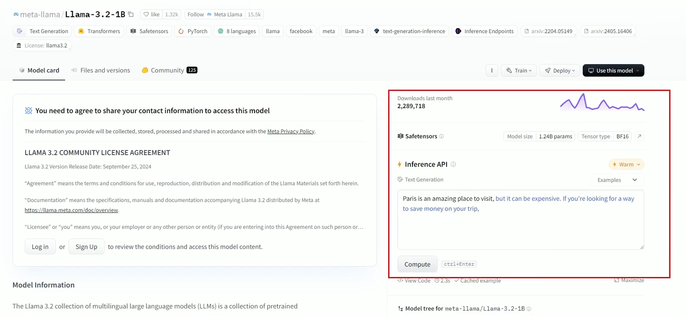
红色框里，可以进行提问（llama3支持中文）


# Datasets
对模型进行训练或微调的时候用到的数据集

 - 3D
 - Audio
 - Geospatial
 - Image
 - Tabular
 - Text         ： 文本数据集（对文本语言有要求，就点击Languages选择语言）
 - Time-series
 - Video

# Hugging Face平台用法
## 1. 注册账号， 登录即可

## 2. 登录后， 可以访问模型库，数据集和文档，也可以管理个人模型和项目

## 3. 头像 》 Access Tokens ： 申请token （在线调用模型需要申请）
  * 目前是免费
  * create new token > 输入token name   
       User permissions里点击授权（可以全部点开）
  * 点击create token按钮，创建好
  * **保存好生成的token（代码里连接Hugging Face的时候需要）**

## 4. 基础环境
 - GPU Nvidia 显存大于4GB （不做强制性要求）
    - 安装 CUDA， CUDNN
    - 下载pyTorch的时候选择CUDA版（注意版本）
- python环境
    - **Anaconda （python环境全家桶，包含python）** ： pycharm配置python时候，指定anaconda下的python.exe
    - pytorch （建议用pip3安装）
    - pycharm

## 5. 安装hugging Face库
Hugging Face提供了 transformers库， 用于加载和使用模型。 可以使用一下命令来安装它：
```bash
pip install transformers
```
如果还需要安装其他依赖库，如 datasets 和 tokenizers， 可以使用一下命令：
```bash
pip install transformers datasets tokenizers
```
* Hugging Face提供了非常多的库， 但是我们只需要上面三个库。

## 6. pycharm 指定anaconda/python.exe
虚拟环境也可以， 用base环境也可以
先从base环境开始， 以后都用虚拟环境


## 7. 实操

#### 1. 基于API接口访问Huggingface平台
# 例子： uer/gpt2-chinese-cluecorpussmall模型: 文本生成（续写）大模型

```python
import requests

# 要访问的模型的在线接口地址
#            hugging face models domain         |models|<- 模型名称全名(在hugging face复制) ->|
API_URL = "https://api-inference.huggingface.co/models/uer/gpt2-chinese-cluecorpussmall"
#                |固定加        |网站域名      |固定加|

```
**hugging face允许不适用token，进行匿名访问** <-有时候不靠谱
```python
import requests

# 要访问的模型的在线接口地址
#            hugging face models domain         |models|<- 模型名称全名(在hugging face复制) ->|
API_URL = "https://api-inference.huggingface.co/models/uer/gpt2-chinese-cluecorpussmall"
#                |固定加        |网站域名      |固定加|

# 调用在线模型（Hugging face上运行的模型）。 不会下载模型，只是在线调用Hugging face服务器上的模型
res = request.post(API_URL, json={"inputs": "你好，Hugging face"})

print(res.json())
```

**使用token访问在线模型**
```python
API_Token = "hf_UxzVdqZaZasShkepbX....lc"
headers = {"Authorization":f"Bearer {API_Token}"}

res = request.post(API_URL,headers=headers, json={"inputs": "你好，Hugging face"})
# 在线调用（模型不会被下载），直接连接hugging face的模型（Hugging face也提供模型服务）
# 这个不是问答模型，而是续写模型：  根据提示词，继续往下续写

print(res.json())
```
运行结果：
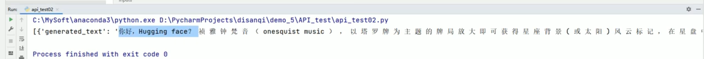

**在线调用Hugging face模型： 要下载，很慢，有时候会失败， 不建议在线调用模型**

### 2. 本地模型调用
1. 将模型下载到本地
2. 调用本地模型

#### 2.1 模型下载到本地
```python
# 将模型下载到本地调用

from transformers import AutoModelForCausalLM, AutoTokenizer

#将模型，分词工具下载到本地，并指定保存路径
model_name = "uer/gpt2-chinese-cluecorpussmall"  # hugging face上的模型名称

# 指定下载目录： 下载到当前目录下 model目录下
cache_dir = "model/uer/gpt2-chinese-cluecorpussmall"

# 下载模型
AutoModelForCausalLM.from_pretrained( model_name, cache_dir=cache_dir )

# 下载分词工具
AutoTokenizer.from_pretrained( model_name, cache_dir=cachedir )

print(f"模型，分词器已下载到： {cache_dir}")

# 在python代码上，右键 》 run  运行python代码， 等待下载模型，分词器
```

 - AutoModelForCausalLM: 调用模型需要
 - AutoTokenizer       ：  
    * 模型其实是个**数学矩阵**， 所以自然语言是无法直接传递给模型的，需要实现把自然语言**分词**，转换成**token向量（语言被转换成一堆数值（词向量））**
    * 每个模型都有自己**配套的词向量工具**


# transformer 其实就是 Hugging Face

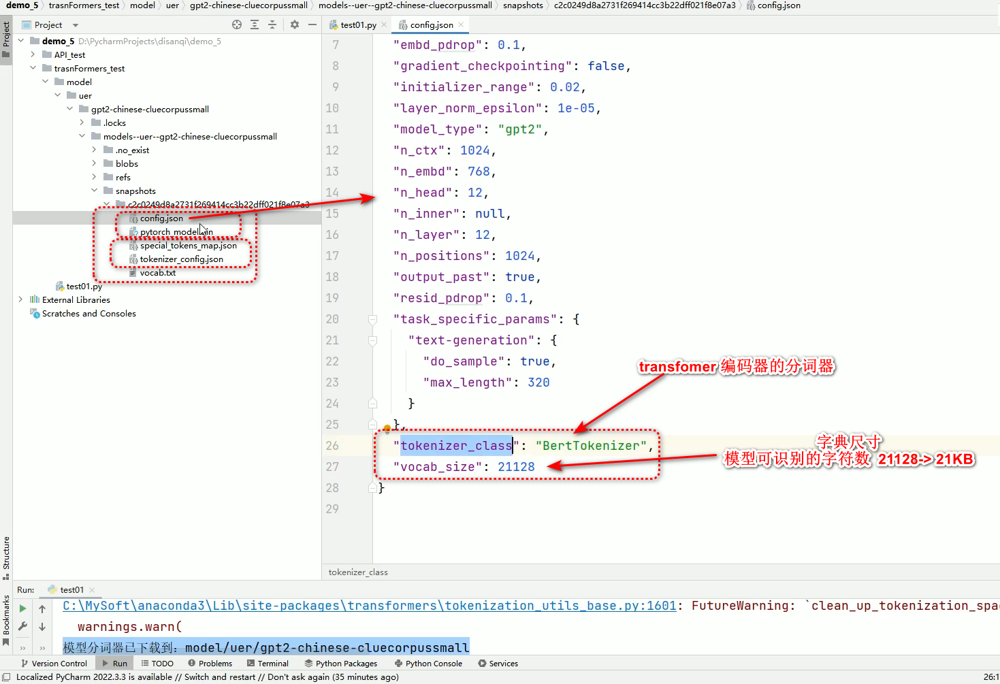

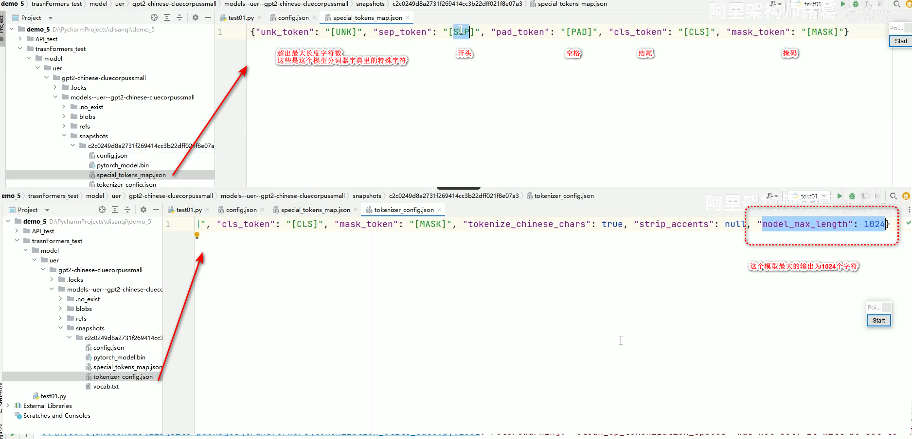

**分词器： 本质就是对字符进行编码。**  
这个模型能够对那些字符进行编码呢？ 它能编码的字符都在 **vocab.txt**里面。
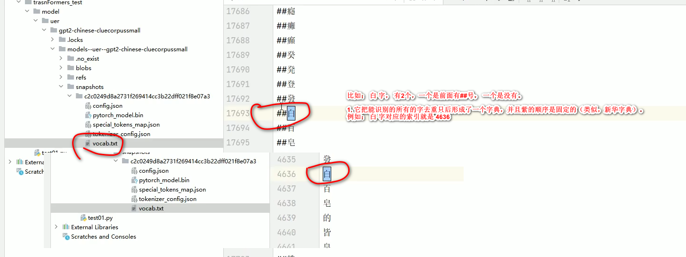
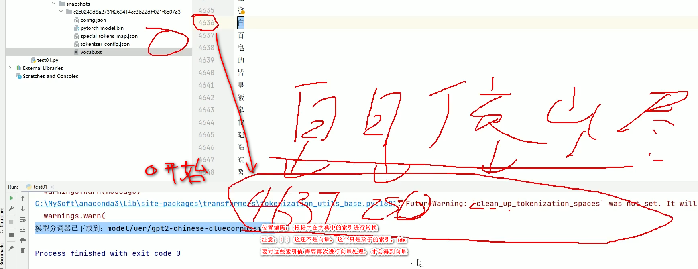

# 所以模型文件需要包含如下这些文件：
 - config.json      ：  模型配置文件
 - pytorch_model.bin：  模型文件
 - special_tokens_map： 特殊字符（有时候跟下面文件合在一起）
 - tokenizer_config.json：
 - wocab.txt         ：  字典（包含可识别的所有字，字符）

#### 2.2 调用本地模型
##### 调用本地大模型： 必须指定到 包含config.json文件的目录为止
##### 1.基本使用方法
```python
from transformers import AutoModelForCausalLM, AutoTokenizer, pipeline

# 注！！ 设置具体包含 config.json 的目录
# 跟下载时候不一样； 下载的时候只要指定hugging face上的模型名称即可
# 本地调用的时候，必须指定到具体包含 config.json 文件的目录为止 
# 相对路径不可（会认为要去Hugging face去下载模型）
# 要指定绝对路径，带盘符
# 字符串前面加 r 是防止转义 （否则 \t 就是特殊字符） 因为 windows里的路径分隔符是 \ 
model_dir = r"x:\path\to\the\config.json's dir\of\the\model"  # 最后没有 \ 

# 加载模型和分词器
model = AutoModelForCausalLM.from_pretrained( model_dir )
tokenizer = AutoTokenizer.from_pretrained( model_dir )

# 使用加载的模型和分词器创建 pipeline
# 调用模型的方法： transformer提供了非常方便的 pipeline
generator = pipeline( "text-generation", model=model, tokenizer=tokenizer )
#                      指定当前的任务
# 例子调用的是 gpt-2， 是文本生成大模型，任务是 文本生成

# 可以调用 generator生成器来生成内容了

# 生成文本

# 示例； gpt2 文本生成大模型的使用方法

# 1. 基本使用方法
output = generator("你好，我是一款语言模型,", max_length=50, num_return_sequences=1)
#                    提示词  ， 让gpt2语言模型接着续写
#                                             续写的最大长度    生成的文章是分几段返回。 1： 用一句话返回即可
```
运行结果：
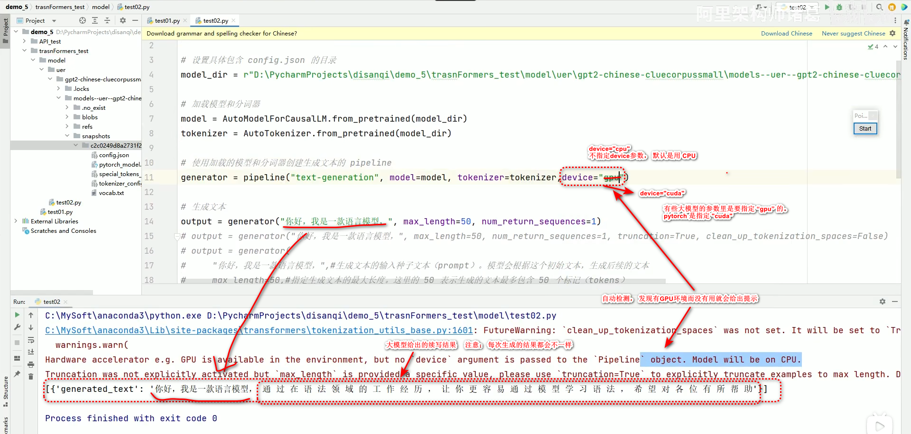

##### 上面的大模型生成的续写文字，其实效果是比较差的。为了让学些的效果好一些，多指定一些参数，如下：
##### 2.高级用法
```python

# 2. 高级调用方法
output = generator(
  # 生成文本的输入种子文本(prompt)。模型会根据这个初始文本，生成后续的文本。
  "你好，我是一款语言模型，",

  # 指定生成文本的最大长度。这里的50表示生成的文本最多包含50个标记（tokens）。
  max_length=50,

  # 指定返回多少个独立生成的文本序列。 1表示只生成并返回一段文本。
  num_return_sequence=1,

  # 决定是否截断输入文本以适应模型的最大输入长度。
  # True； 超出模型最大输入长度的部分将被截断；
  # False：不截断。模型可能无法处理过长的输入，可能会报错
  truncation=True,

  # 温度。控制生成文本的随机性。
  # 值越低：生成的文本越保守（倾向于选择概率较高的词）
  # 值越高：生成的文本越多样（倾向于选择更多不同的词）
  # * 0.7 是一个较为常见的设置，既保留了部分随机性，又不至于太混乱。
  temperature=0.7,

  # 一下两个参数是控制结果的核心

  # 步长。 限制模型在每一步生成时仅从概率最高的 k 个词中选择下一个词。
  # 50 表示模型在生成每个词的时候只考虑概率最高的前50个候选词，从而减少生成不太可能的词的概率。
  # * 1： 每次生成的结果是固定的； >1：从多个当中选择生成的字， 所以每次生成的会有所不同，数值越大，每次答案差别更大
  top_k=50,

  # 核采样。 进一步限制模型生成时的词汇选择范围。它会选择一组累计概率达到 p 的词汇，模型只会从这个概率集合中采样。
  # 0.9 意味着模型会在可能性最强的 90% 的词中选择下一个词，进一步增加生成的质量。
  top_p=0.9,

  # 控制生成的文本中是否清理分词时引入的空格(注！ 不是普通的空格，指的是段落，首行缩进，古诗词格式之类的)。
  # True： 生成的文本会清楚多余的空格；
  # False：保留原样。
  # 默认值即将改变为 False，因为它能更好地保留原始文本的格式。
  clean_up_tokenization_spaces=False
)

print( output )
```

运行结果：
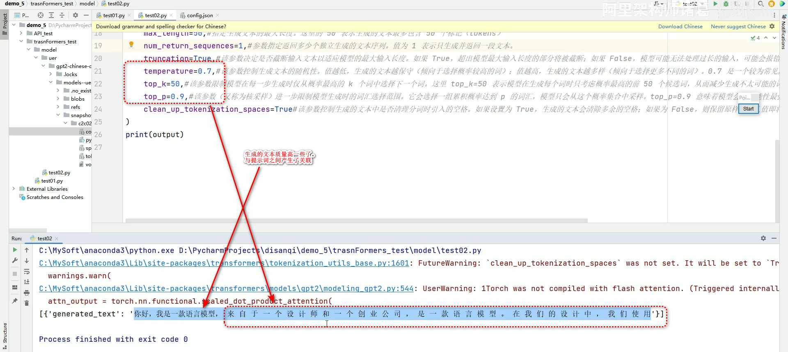

**生成2段（生成2个）**
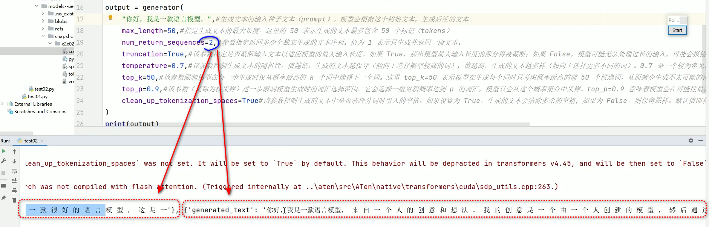

**关于 top_p的讲解（p: percent）**
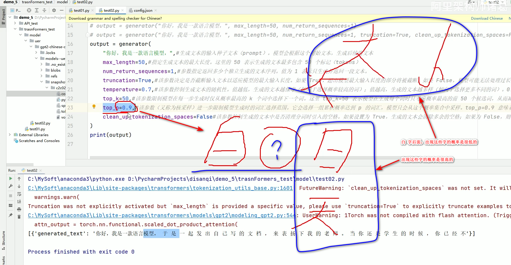

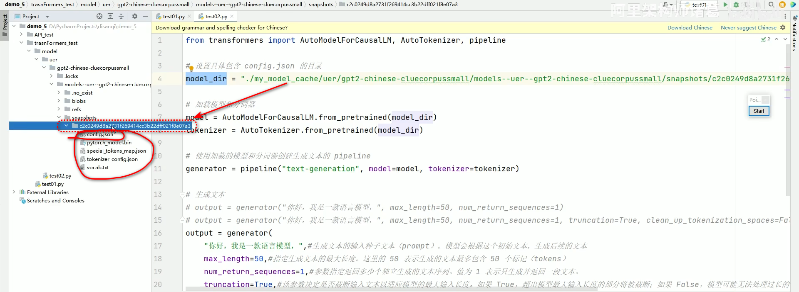  


