# hugging face上的所有大模型都是基于 transformer构建的
transformer大模型都由 **编码器，解码器** 构成  

transformer的最基础的编码器叫 **Bert**；
最基础的解码器叫 **GPT**  

* Bert模型的作用： **文本的特征提取**，输入文本，输出向量数据。  一般用来做**分类的任务**  
* GPT           ： **解码器**。  输入向量数据， 输出文本数据。 用来**生成文本**


# 用Bert来训练一个情绪评价分类的模型
## 示例用的模型： bert-base-chinese    <-- 文本序列化模型
```python
# 用Bert的模型，Bert的分词器，故导入 Bert的 tokenizer
# BertForSequenceClassification： Bert的序列分类大模型
# BertTokenizer                ： Bert的tokenizer
from transformers import BertForSequenceClassification，BertTokenizer
from transformers import pipeline

# 加载模型和分词器
#model_name = "bert-base-chinese"  # 需要：hugging face上可以搜索到的模型名称= 
model_name = r"x:\path\to\the\model"  # 下载到本地的模型所在目录绝对路径

model = BertForSequenceClassification.from_pretrained( model_name )
tokenizer = BertTokenizer.from_pretrained( model_name )

# 创建分类 pipeline
classifier = pipeline("text-classification", model=model, tokenizer=tokenizer)
#                      文本分类任务

# 进行分类
result = classifier( "你好，我是一款语言模型" )

print( result )
```
运行结果：
注意！！ **目前以上的代码还无法分类文本**，输出也是一段数字
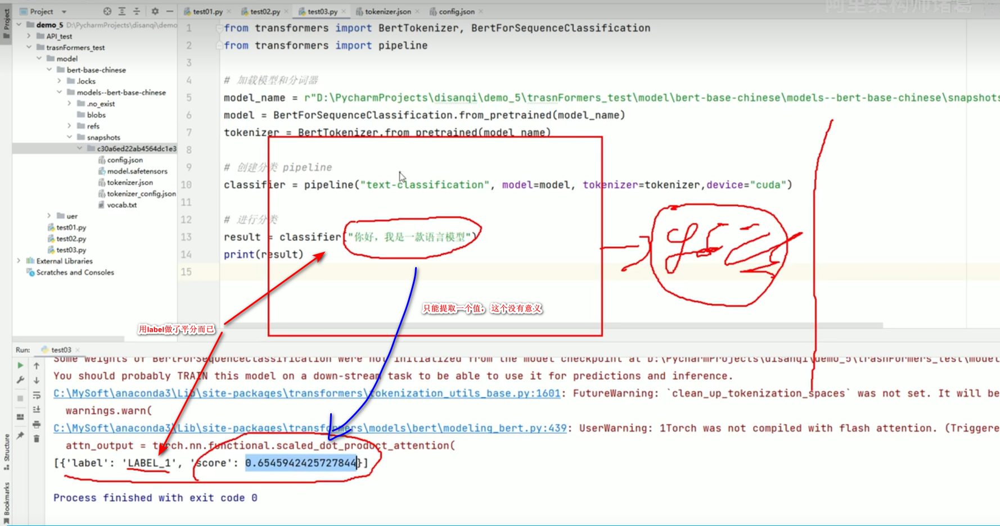

**现在的模型：只能输入一段文本，提取这个文本的特征信息，输出一个特征向量，但是它并不知道我们要做什么事情。 我们需要根据具体业务需求给它一个场景。**

##### 例： ai.baidu.com ： 百度大脑 AI开放平台， 情感分类演示
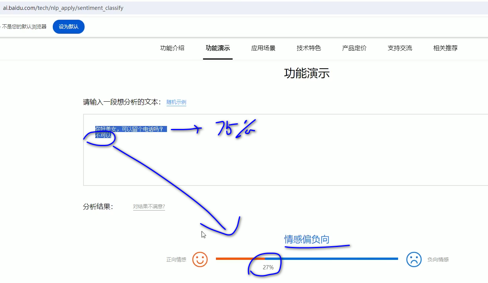
* 情感二分类； 很有价值。 例如 购物平台的 评论情感分析提取， 对评论区做判定。 好评，差评之类的
* 可以做 舆情监控

**场景赋予：假设有一套情绪的数据， 可以根据这个数据做一个 数据集，利用这个数据集对模型进行微调训练**  

例子数据： 二分类而数据
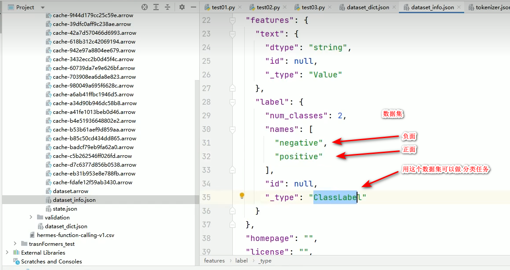
**用以上二分情绪数据集，对模型进行微调**

**上面的python代码，用Bert模型对于输入语言进行了分类，但是分类的结果是没有意义的（只是单纯的分类了而已），需要对此Bert模型进行微调，利用上面的情绪二分类数据集进行微雕。**

## Dataset： 数据集   可以从Hugging face下载， 然后加载到本地来训练本地模型
## 例： dataset: hermes-function-calling-v1
## 在线加载数据集
```python
from datasets import load_dataset # 在线加载某个数据集（本地里没有就自动从hugging face下载）

# 在线加载数据 （注意！ 不推荐。 不管本地有没有，先要联网。 下载也慢，因为都是google云盘上的）
dataset = load_dataset( path=“NousResearch/hermes-function-calling-v1”, split="train" )  # hugging face上dataset的名称
# split="train" ： 加载训练的部分。 必须要给个训练

print( dataset )  # 可以看得到

# 右键 进行 Run， 这个数据就会加载进来（在线加载， 下载保存到本地）
```
运行结果：
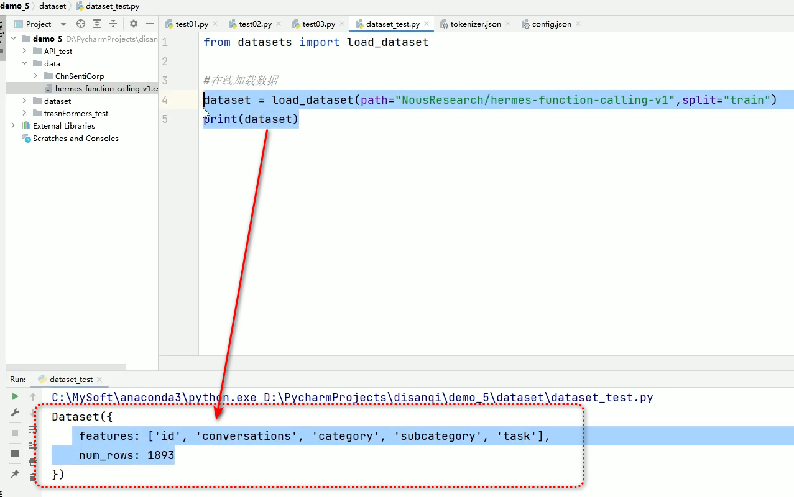

-------------------------------------------------------------------------------------------------

**没有给缓存路径，默认下载到如下位置：**  
**c:\用户\当前用户\.cache\huggingface/datasets**
* 数据集文件扩展名： .arrow
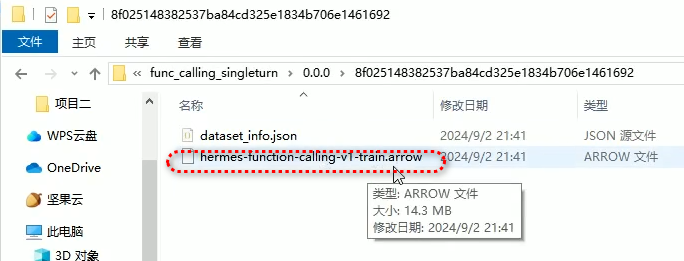

数据集是自己的一种加密格式，看不了， 但是**可以通过代码加载**。  

## 加载本地数据集（需要先将数据集下载到本地）
```python
# from datasets import load_dataset # 在线加载某个数据集（本地里没有就自动从hugging face下载）
from datasets import load_from_disk # 从磁盘加载数据集

# 在线加载数据 （注意！ 不推荐。 不管本地有没有，先要联网。 下载也慢，因为都是google云盘上的）
#dataset = load_dataset( path=“NousResearch/hermes-function-calling-v1”, split="train" )  # hugging face上dataset的名称
# split="train" ： 加载训练的部分。 必须要给个训练

# 加载本地磁盘里的 数据集
dataset = load_from_disk(r"x:\path\to\the\dataset")  # e.g.: "d:\xxxx\ChnSentiCorp"
print( dataset )  # 可以看得到

# 右键 进行 Run， 这个数据就会加载进来（在线加载， 下载保存到本地）
```
本地数据集路径：
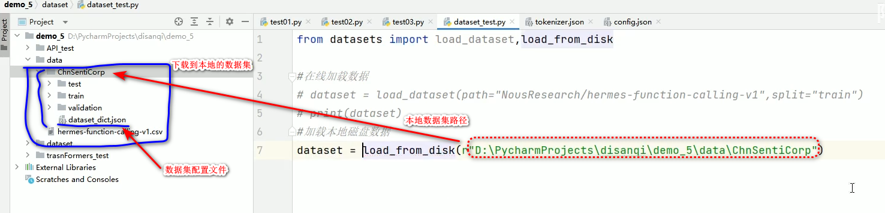

代码运行结果： 可以看到数据集里的内容
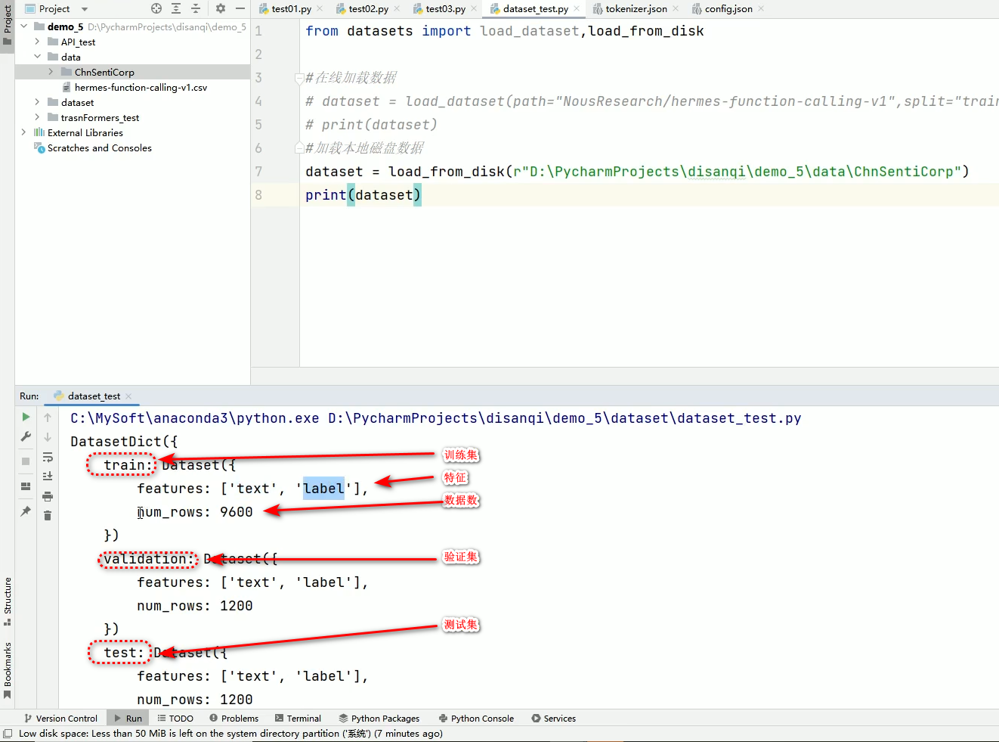

## 取出训练集看一下
```python
from datasets import load_from_disk # 从磁盘加载数据集

# 加载本地磁盘里的 数据集
dataset = load_from_disk(r"x:\path\to\the\dataset")  # e.g.: "d:\xxxx\ChnSentiCorp"
print( dataset )  # 可以看得到

# 取出测试集
test_data = dataset["test"]
print( test_data )
# 运行结果：  test_data是一个 Dataset对象
# Dataset({
#     features: ['text', 'label'],
#     num_rows: 1200
# })

# 若要查看测试数据，就遍历这个 Dataset 对象内容
for data in test_data:
    print( data )
```
运行结果：
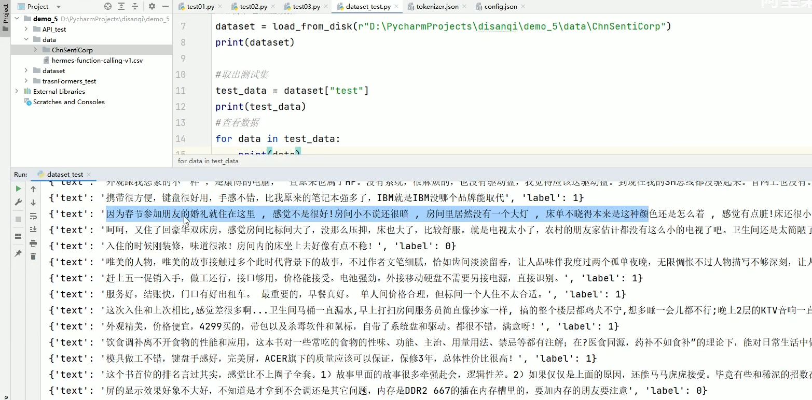

label的值，以及其含义：
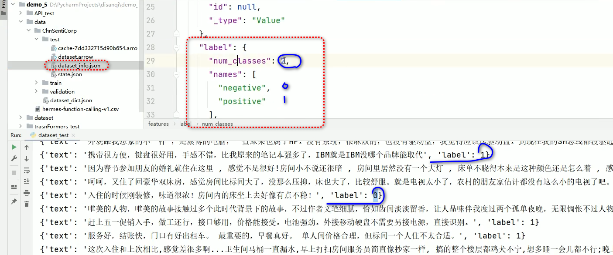

#### 以上训练，验证，测试数据集都是人工做的，人工标注的。

### 以上只是测试用，真正的微调不需要写这些代码，模型都给写好了，只需要设置参数即可。
### 但是数据集需要做，数据集 只能人工做。 但是格式可以自动转。

### 有些句子无法判断是好是坏，存在争议，这样的语句都单独挑出来，跟甲方确认，要不要加进训练数据集里。模糊不清的句子也会影响模型的质量。

### 数据集是人为指定的。数据集的准确性直接影响到训练后的模型的质量。

# 向量： 在模型（model）里面
```python
# 用Bert的模型，Bert的分词器，故导入 Bert的 tokenizer
# BertForSequenceClassification： Bert的序列分类大模型
# BertTokenizer                ： Bert的tokenizer
from transformers import BertForSequenceClassification，BertTokenizer
from transformers import pipeline

# 加载模型和分词器
#model_name = "bert-base-chinese"  # 需要：hugging face上可以搜索到的模型名称= 
model_name = r"x:\path\to\the\model"  # 下载到本地的模型所在目录绝对路径

model = BertForSequenceClassification.from_pretrained( model_name )
tokenizer = BertTokenizer.from_pretrained( model_name )

# 创建分类 pipeline
classifier = pipeline("text-classification", model=model, tokenizer=tokenizer)
#                      文本分类任务

# 进行分类
result = classifier( "你好，我是一款语言模型" )

print( result )

print( model )  # 打印模型结构
```
执行结果：
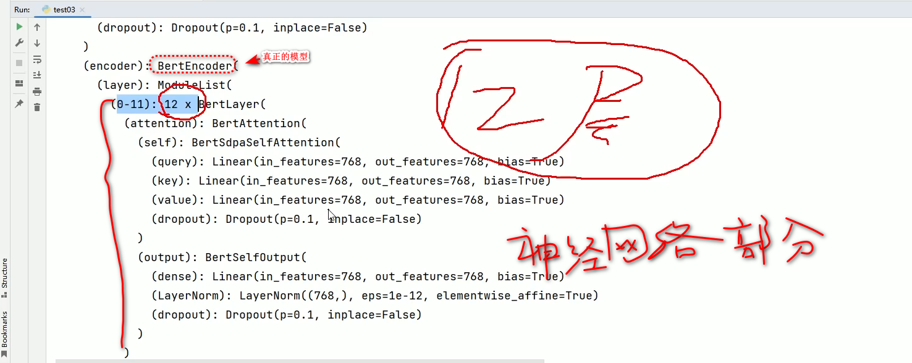
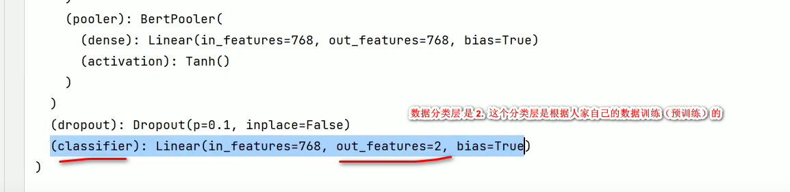

##### 接下来任务：
自己设计网络层，拿自己的数据集文本转换成位置编码，再把位置编码给到Bert模型里面，让它按照我们的数据进行训练。  

训练之后，再拿测试集进行测试。  

这个任务其实训练起来非常快，并且效果也不错，精度可以做到90%以上。


### 有些数据集不是 .arrow格式的， 有些是 .csv格式， Hugging face也可以加载csv格式数据集。

### transformer模型的输入是固定的。
### 但是数据集的格式是五花八门，没有固定标准。  
### 数据集其实是 把你要判断的文本，变成一段位置编码的数字就行了，能给到模型即可。
### 现在每个大模型所要求的数据格式不一样

### 模型为什么是12层？  
开发模型的人试出来的， 发现12层最好，等等。

Google：   疯狂发论文
Open AI ： 疯狂实现， 所以首先做出来 GPT。

谷歌发论文，还没有来得及做出来，Open AI就已经开始干了。  

小参数模型：    小模型
大参数模型：    大模型    当10亿参数以上的时候，效果指数级增长，所以用这个区分大模型，小模型。

transformer 12层也是同样。

3B ：  30亿参数

7B：  70亿参数  本地用

智谱清言： 效果好， 因为参数大，例如 1300亿， 服务器多。  


