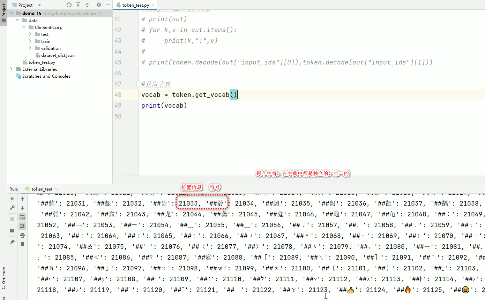
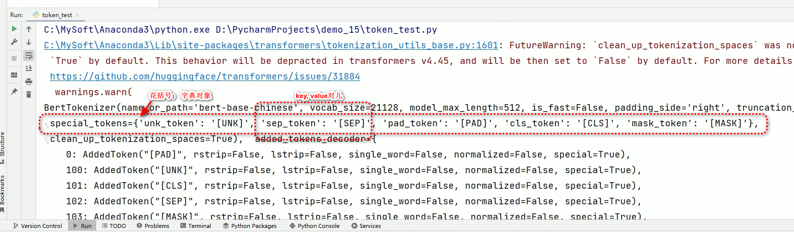
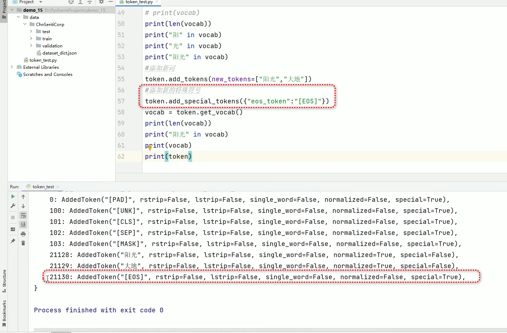
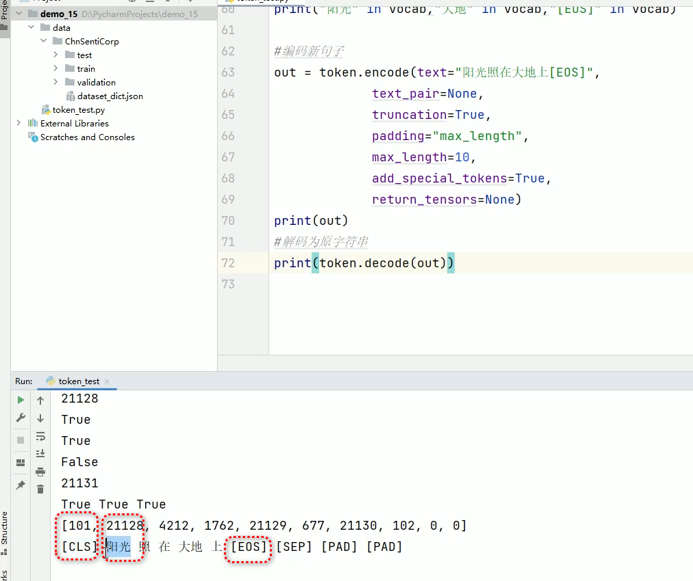

# 内容
  1. vocab字典操作 （自定义字典）
  2. 模型微调的基本概念
  3. 下游任务模型设计 （所有的自然语义相关的都要会做）
  4. 自定义模型训练与效果评估

案例： 自定义下游任务实现中文评价分析模型的本地化训练与测试

# 代码 - 获取字典
```python
from transformers import BertTokenizer

# 加载字典和分词工具
token = BertTokenizer.from_pretrained( "bert-base-chinese" )
# print(token)
# exit()

sents = ["酒店太旧了，大唐感觉像三星级的，房间也就是好点的三星级的条件，在xxxx。。。",
         "已经贴完了，又给小区的妈妈买了一套。最值得推荐",
         "xxxxx",
         "....."]

#批量编码句子
# out = token.batch_encode_plus(
#   batch_text_or_text_pairs=[sents[0],sents[1]],
#   add_special_tokens=True,
#   truncation=True,
#   padding="max_length",             # 一律补零到max_length长度
#   max_length=30，
#   return_tensors=None,              # 可取值 tf, pt, np. 默认为返回list
#   return_attention_mask=True,       # 返回 attention mask
#   return_token_type_ids=true,       # 返回token type ids
#   return_special_tokens_mask=True,  # 特殊符号标识
# )

# input_ids            就是编码后的词
# token_type_ids       第一个句子和特殊符号的位置是0，第二个句子的位置是1
# special_tokens_mask  特殊符号的位置是1， 其他位置是0
# attention_mask       pad的位置是0，其他位置是1
# length               返回句子长度
# print(out)

# for k, v in out.items():
#     print(k, ":", v)

# print(token.decode(out["input_ids"][0]), token.decode(out["input_ids"][1]))

# 获取字典
vocab = token.get_vocab()  # 字典就在token里
print(vocab)
```
运行结果：


### 获取某个字在不在字典里面
```python
...

# 获取字典
vocab = token.get_vocab()

# 查询某个字是不是在字典里
# 阳”字存在于否
print("阳" in vocab)    # 结果： True

print("光" in vocab)    # 结果： True

print("阳光" in vocab)  # 结果: False
# 字典里都是单个字，没有组合字
```
### 对字典进行添加新词操作
```python
...

# 获取字典
vocab = token.get_vocab()

# 查看字典长度
print( len(vocab) )  # 21128

# 查询某个字是不是在字典里
# 阳”字存在于否
print("阳" in vocab)    # 结果： True

print("光" in vocab)    # 结果： True

print("阳光" in vocab)  # 结果: False
# 字典里都是单个字，没有组合字

# 添加新词
token.add_tokens(new_tokens=["阳光", "大地"])  # 添加到最末尾

# 重新获取字典
vocab = token.get_vocab()

# 查看字典长度
print( len(vocab) )  # 21130 (加了2个)

print("阳光" in vocab)  # 结果： True
```
### 给token添加新的特殊符号（special token）
```python
...

# 获取字典
vocab = token.get_vocab()

# 添加新词
# token.add_tokens(new_tokens=["阳光", "大地"])  # 添加到最末尾

# 添加新的特殊符号 （用 key/value 对儿的形式添加）
token.add_special_tokens( {"eos_token":"EOS"} )  # 自定义的特殊符号

# 重新获取字典
vocab = token.get_vocab()
print(vocab)
print(token)
```
##### 查看既存模型里的特殊符号，确认格式


执行结果：


#### 至此，刚才添加的词都在字典里，可以查询了
#### print("阳光" in vocab, "大地" in vocab, "[EOS]" in vocab)  # 结果： 三个吃都存在，结果都是True

#### 用新的字典，编码新句子
```python
...

# 编码新句子 batchxxx 批量编码, encode():只一个编码
out = token.encode( 
    text="阳光照在大地上[EOS]",   # 新的字典里，“阳光”是一个词， [EOS]是一个特殊符号
    text_pair=None, 
    truncation=True, 
    padding="max_length", 
    max_length=10, 
    add_special_tokens=True,
    return_tensors=None )

print(out)
# 结果：
# [101, 21128, 4212, 1762, 21129, 677, 21130, 102, 0, 0]

# 解码为元字符串
print( token.decode(out) )
```
运行结果：


### 既存的字典数据里基本上已经都涵盖了常用的所有词，一般情况下不需要我们自己再添加新词了。
### 但是万一有特殊需求，需要添加新词的时候，就可以用这种方法


