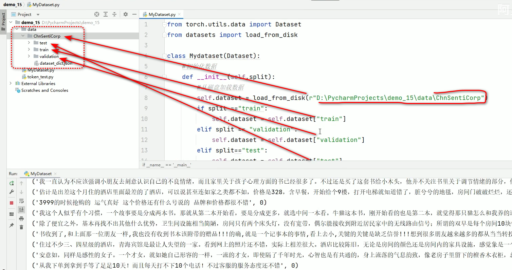
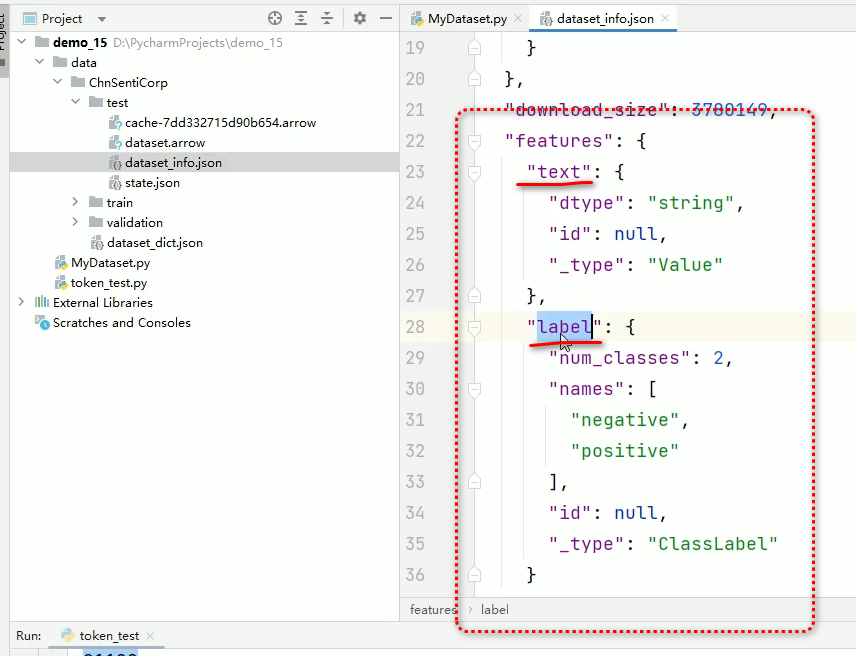
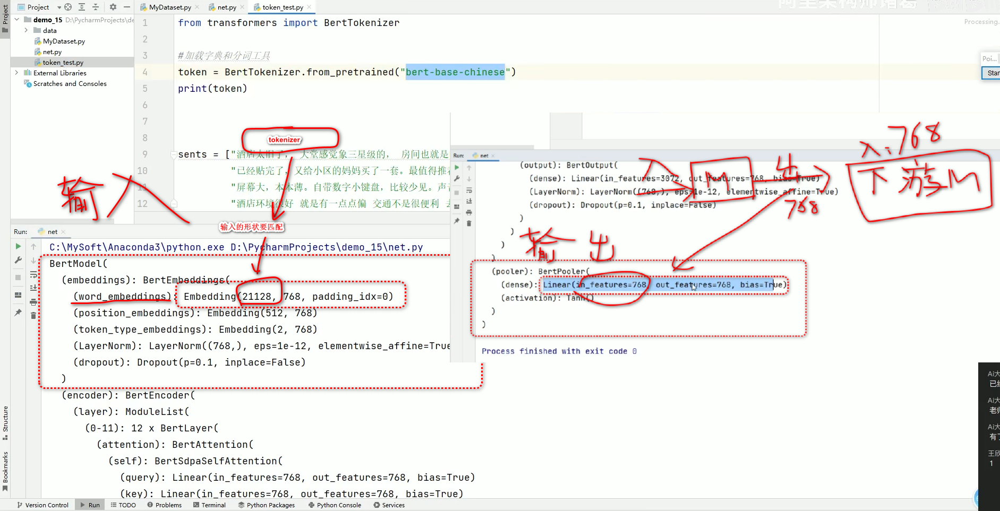
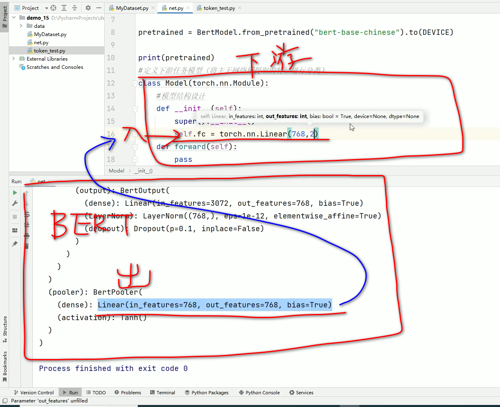
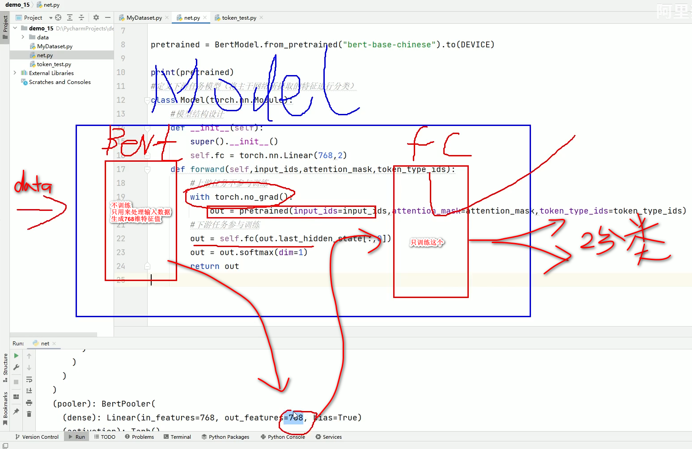

# 1.模型微调的基本概念与流程

指在**预训练模型的基础**上，通过**进一步的训练**来适应特定的下游任务。  
BERT模型通过预训练来学习语言的通用模式，然后通过**微调来适应特定任务**，如情感分析，命名实体识别等。  
微调过程中，通常**冻结BERT的预训练层**，只训练与下游任务相关的层。  

示例： 使用BERT模型进行情感分析任务的微调训练  

# 2.加载数据集（本地CSV数据）
情感分析任务的数据通常包括文本及其对应的情感标签。使用Hugging face的datasets库可以轻松地加载和处理数据集。
```python
from datasets import load_dataset

# 加载数据集
dataset =load_dataset("csv", data_file="data/ChnSentiCorp.csv")  # 本地上的数据

# 查看数据集信息
print(dataset)
```

## 2.1数据集格式
Hugging Face的datasets库支持多种数据集格式，如**CSV，JSON，TFRecord等**。  
本次使用CSV格式，CSV文件包含两列：文本数据列 和 情感标签。  

## 2.2数据集信息
加载数据集后，可以查看数据集的基本信息，如数据集大小，字段名称等。这有助于连接数据的分布情况，并在后续步骤中进行适当的处理。

# 3.制作Dataset
加载数据集后,需要对其进行处理以适应模型的输入格式。这包括**数据清洗**，**格式转换**等操作。
```python
from datasets import Dataset  # pyTorch的Dataset也可以制作数据集

# 制作Dataset *另外一种数据集的制作方法
dataset = Dataset.from_dict(  # from_dict(); 可以指定字典类型数据(python 字典类型 )
    "text": [  # 数组
        "位置尚可，但距离海边的位置比预期的要差得多",                     # 第一条文本
        "5月8日付款成功，当当网显示5月10日发货，可是至今还没有看到货物",  # 第二条文本
        "整体来说本书还是不错的。至少在书中描述了许多司法系统问题。"      # 第三条文本
    ],
    "label": [  # 数组
        0,       # 第一条文本： 负面 （0：负面； 1：正面）
        1,       # 第二条文本： 正面
        1]       # 第三条文本： 正面
)

# 查看数据集信息
print( dataset )
```

## 3.1数据集字段
在制作Dataset时，需定义数据集的字段。  
此次案例中，定义了两个字段： **text（文本）**和**label（情感标签）**。  
每个字段都需要**与模型的输入和输出匹配**。

## 3.2数据集信息
制作Dataset后，可以通过 **dataset.info** 等方法查看其大小，字段名称等信息，以确保数据集的正确性和完整性。

# 整体代码
```python
from torch.utils.data import Dataset  # pyTorch库
from datasets import load_from_disk   # transformer库

class Mydataset(Dataset):
  # 初始化数据

  # split来判断是训练集，验证集还是测试集
  def __init__(self, split):
    # 从磁盘加载数据
    self.dataset = load_from_disk("D:/path/to/the/data")  # r"D:\path\to\the\data" 都可以

    if split == "train":         # 微调（训练数据）
      self.dataset = self.dataset["train"]
    elif split == "validation":  # 验证数据
      self.dataset = self.dataset["validation"]
    elif split == "test":        # 测试数据
      self.dataset = self.dataset["test"]
    else:
      print("数据集名称错误！") 
  
  # 获取数据集大小
  def __len__(self):
    return len(self.dataset)
  
  # 对数据定制化处理(返回数据和标签对)
  def __getitem__(self, item):
    test = self.dataset[item]["text"]    # 文本数据
    label = self.dataset[item]["label"]  # 标签

    return text, label

  # 数据示例： {"text":"文本数据xxxxxx", "label":"0"}

  # 验证一下
  if __name__ == "__main__":
    dataset = Mydataset("validation")

    for data in dataset:
      print(data)

```
## 本地数据集指定方法


## 第三方数据集介绍文件


# 4.vocab字典操作
在微调BERT模型之前，需要将模型的**词汇表(vocab)**与**数据集中的文本**匹配。  
这一步骤确保输入的文本能够被正确转换为模型的输入格式。

```python
from transformers import BertTokenizer

# 加载BERT模型的vocab字典
tokenizer = BertTokenizer.from_pretrained("bert-base-chinese")

# 将数据集中的文本转换为BERT模型所需的输入格式
dataset = dataset.map(
  lambda x: tokenizer( x["text"], return_tensors="pt"),
  batched=True
)

# 查看数据集信息
print( dataset )
```

## 4.1词汇表(vocab)
BERT模型使用词汇表（vocab）将**文本**转换为**模型可以理解的输入格式**。  
**词汇表**包含模型已知的**所有单词及其对应的索引**。

## 4.2文本转换
使用**tokenizer 将文本分割成词汇表中的单词，并转换为相应的索引**。  
此步骤需要确保文本长度，特殊字符处理等都与BERT模型的预训练设置相一致。

# 5.下游任务模型设计
## 5.1设计微调模型 Model

在微调 BERT模型之前，需要设计一个**适应情感分析任务的 下游模型结构**。 
通常包括一个或多个**全连接层**，用于将BERT输出的特征向量转换为分类结果。
```python
# 加载预训练模型需要的库
from transformers import BertModel

# 下游任务模型用 pyTorch来实现
import torch

# 定义训练设备
DEVICE = torch.device("cuda" if torch.cuda.is_available() else "cpu")

# 加载预训练模型（上游任务）
pretrained = BertModel.from_pretained( "bert-base-chinese" ).to(DEVICE)  # 缓存到默认路径下的模型（没有就到Huggingface自动下载）

# 验证是否正确加载
#print(pretrained)

# 要想微调，可以先把加载后的预训练好的模型的输入部分打印出来，查看结构
#print(pretrained.embeddings)
#print(pretrained.embeddings.word_embeddings)  # 输入分词器构造
# 例; 输出结果：
# Embedding(21128, 768, padding_idx=0)  # 输入21128， 中间层768 的向量（tensor）

# 本次的核心是下游模型
# 预训练模型的输出是 768， 那么下游模型的输入需要是 768， 要互相匹配
# 预训练模型输出： Linear(in_features=768, out_features=768, bias=True)

# 我们的数据经过第一个 BERT模型之后，输出的维度是768

# 定义下游任务模型（将主干网络锁提取的特征进行分类）
# 数据 -》 BERT  -》768维向量  -》 下面的Model  -》 2维 （1：正面； 2：反面） 
class Model(torch.nn.Module):
  # 模型结构设计
  def __init__(self):
    super().__init__()

    # 新的模型的输入定义 输入768维，完成2分类任务
    self.fc = torch.nn.Linear(768, 2)  # 输入： Linear:全连接模型 <-- 因为BERT模型的输出就是 Linear(in_feature=768, out_features=768, bias=True)
  
  def forward(self, input_ids, attention_mask, token_type_ids):
    # 上游任务不参与训练，只训练下游任务
    with torch.no_grad():  # 权重锁死（不参与训练）
      out = pretrained(input_ids=input_ids, attention_mask=attention_mask，token_type_ids=token_type_ids)
    
    # 下游任务参与训练
    out = self.fc( out.last_hidden_state[:,0])
    out = out.softmax(dim=1)

    return out

```
### 我们的数据经过第一个 BERT模型之后， 输出的向量维度是 768.
#### 对于预训练模型，只关注2个；  1.  输入；  2. 输出





## 以上，模型 Model设计好了，下面使用这个模型
## 5.2 使用设计好的模型，进行微调
```python
import torch
from MyData import Mydataset
from torch.utils.data import DataLoader

from net import Model

from transformers import BertTokenizer, AdamW

# 定义训练设备
DEVICE = torch.device("cuda" if torch.cuda.is_available() else "cpu")

EPOCH = 100  # 训练的轮数

token = BertTokenizer.from_pretrained( "bert-base-chinese" )  # BERT分词器( 输入文本 -> 分词，词向量)

# 自定义函数，对数据进行编码处理
def collate_fn(data):
  sentence = [i[0] for i in data]
  label = [i[1] for i in data]

  # 编码
  data = token.batch_encode_plus(  # 将文本进行编码(转成向量值)
    batch_text_or_text_pairs=sentence,
    truncation=True,
    padding="max_length",
    max_length=350,
    return_tensor="pt",    # pyTorch的意思？
    return_length=True
  )

  input_ids = data["input_ids"]
  attention_mask = data["attention_mask"]
  token_type_ids = data["token_type_ids"]

  labels = torch.LongTensor(label)  # label是py数值， 要转成BERT的类型

  return input_ids, attention_mask, token_type_ids, labels

# 创建数据集
train_dataset = Mydataset("train")  # 自动下载数据集

# 创建DataLoader
train_dataset = DataLoader(
  dataset=train_dataset,
  batch_size=32,          # 每次导入的数据数 32个
  shuffle=True,           # 数据打乱
  drop_last=True,         # 最后的数据不够的时候，就砍掉
  collate_fn=collate_fn
)

if __name__ == "__main__":
  # 开始训练
  print(DEVICE)

  model = Model().to(DEVICE)

  optimizer = AdamW(model.parameters(), lr=5e-4)

  loss_func = torch.nn.CrossEntropyLoss()

  # 开启训练模式
  model.train()

  for epoch in range(EPOCH):
    for i, (input_ids, attention_mask, token_type_ids, labels) in enumerate(train_loader):
      # 将数据放到DEVICE上
      input_ids =　input_ids.to(DEVICE)
      attention_mask = attention_mask.to(DEVICE)
      token_type_ids = token_type_ids.to(DEVICE)
      labels = labels.to(DEVICE)
      
      # 执行前向计算得到输出
      out = model(input_ids, attention_mask, token_type_ids)

      loss = loss_func(out, labels)

      optimizer.zero_grad()
      loss.backward()
      optimizer.step()

      # 每隔5轮输出结果
      if i%5 == 0:
        out = out.argmax(dim=1)
        acc = (out == labels).sum() / len(labels)  # 计算准确率

        print(epoch, i, loss.item(), acc)
    
    # 保存模型参数
    torch.save(model.state_dict(), f"params/{epoch}bert.pt")  # 保存目录需要自己创建，相对路径即可
    print(epoch, "参数保存成功！")


```


