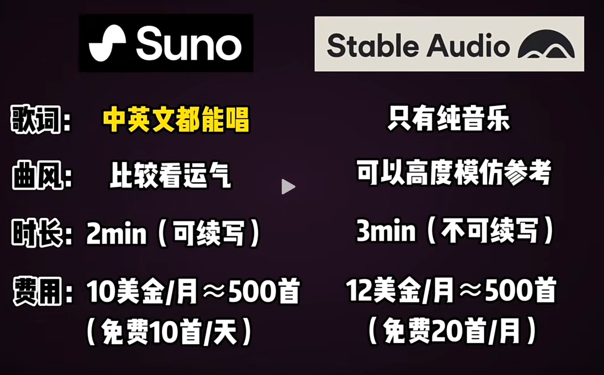

# AI

## **文本**

价格都一样 会员费: 20 美金/月

**ChatGPT-4**
No.1 理论上最强的大模型
另一点好处： 顺带可以使用 Dall-E 来出图

**Claude 3**
长文本第一人
看书，看论文，整理海量信息
回答数学问题，复杂问题上的跑分超越了 GPT4

**Gemini**
谷歌的买点是多模态能力
对语音，图片的理解能力优秀

**Poe**
官方套壳
老板是美国版知乎 Quora 的创始人，同时还是 OpenAI 的董事会成员
用同样价格，把市面上所有的头部大模型都集成在一起
一次性付费，体验所有大模型
唯一缺点： OpenAI 一旦要发布升级，例如 GPTs 等，有一些延迟更新

#### No.1 ChatGPT 强大，稳定，通用

###### No.2 POE 一站式畅想顶级 AI

###### No.3 Claude 科研助手不二之选

###### No.4 Gemini 玩玩儿图一乐不错

## **图像**

**Stable Deffusion**
免费
生态极其丰富
需要显卡条件，本地部署使用门槛，学习成本都比较高，易用成都也很不错

**Midjourney**
收费
最好看的图片生成工具，图片质量极高
10 美金/月 200 张图，无快速通道
30 美金/月 无限出图，15 小时快速通道
60 美金/月 无限出图，30 小时快速通道，有隐私模式。

其他的大模型都准备用 Midjourney 来训练模型了。

**Dall-E 3**
收费
Dall-E 最大的优势是集成在 ChatGPT 中，而且它理解人话的能力最强

**Canva**
收费 官方最低价 300 元/年 （可以看看淘宝）
AI 图片设计工具。 设计师必备，超便捷的图片生成和丰富的编辑功能

## **视频**

**Sora** 之前， 生成视频最常用的是：

- **Stable Video Diffusion**
  简单高效，效果稳定。
  有条件的话，本地部署会更舒心
- **Runway**
  功能丰富，擦除物体，编辑画面，控制镜头
- **Pika**
  动画风格比较好用
  今年新出一个口型功能，可以年台词
- **Haiper**
  最近新出的，还在完全免费

  ## No.1 SVD 免费就是王道 （可以本地部署）

  ###### No.2 Runway 功能丰富，性价比不错

  ###### No.3 Pika 二次元和对口型专区

  ###### No.4 Haiper 免费尝鲜，值得一试

## **音频**

- **Suno**
  只要几句话的输入，人均达到了音乐人的水平
  **优点： 能唱中文歌曲，每天免费 10 首歌**

- **Stable Audio**
  给它参考，就能扒曲子
  优点：
  所以对曲风的控制会更好
  缺点：
  只能出纯音乐， 12 刀会员也是 500 首
  

## **AI 浏览器和编程助手**

- 浏览器 , **搜索**
  **Perplexity <- 代替百度，google**
  费用：基础版免费； 专业版 20 美元/月 **免费版就很 OK 了，不需要会员**
- 编程类
  **ChatGPT-4**
  20 美元/月
  梳理思路
  查阅概念
  补充知识

  **Github Copilot**
  10 美元/月
  **写代码**
  **找 BUG**
  **做注释**

## **数字人， 让照片开口说话**

**阿里 EMO**，效果非常惊人。 一旦开源，第一时间应该使用的
现在比较能用的：

- **HeyGen**
  费用： 29 美元/15 分钟视频
  国内用户使用有门槛，IP 限制严格， 但是**数字人效果最好，功能丰富**  
  **抖音大批视频都是用它做的**
- **D-ID <- HeyGen 的平替**
  费用： 5 美元/10 分钟视频
  功能没有 HeyGen 那么多，但是让照片说话的功能效果差不多

- ### 免费方案 ： 需要本地部署
  #### SadTalker
  操作难度和效果还算不错
