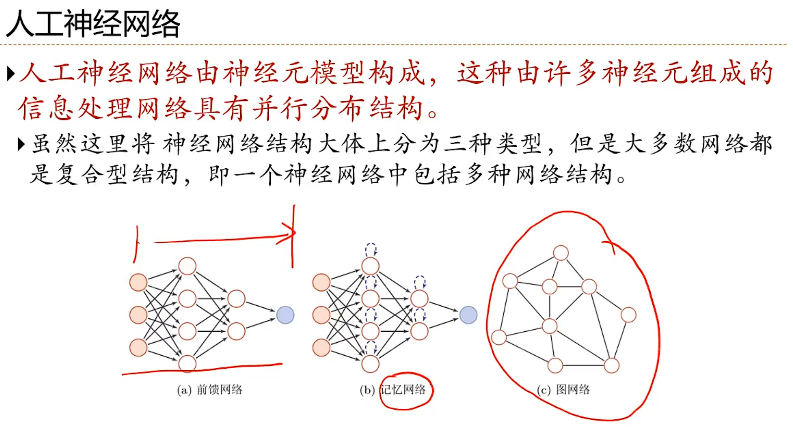
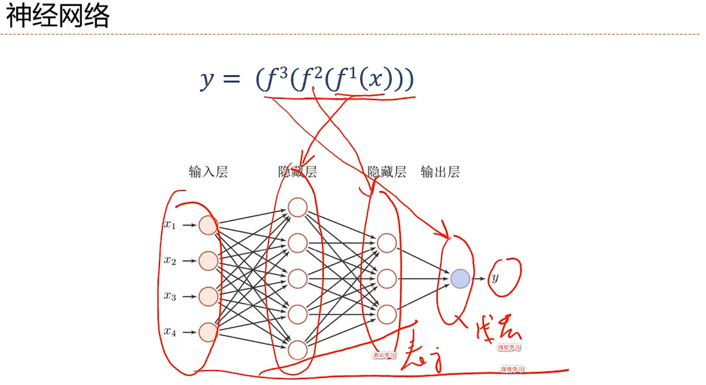
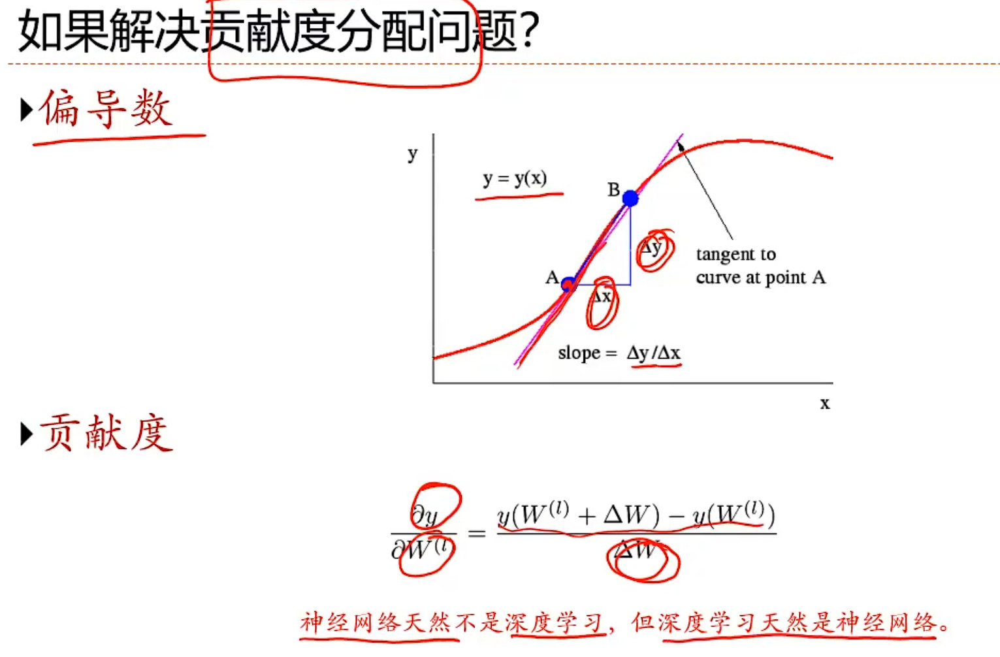
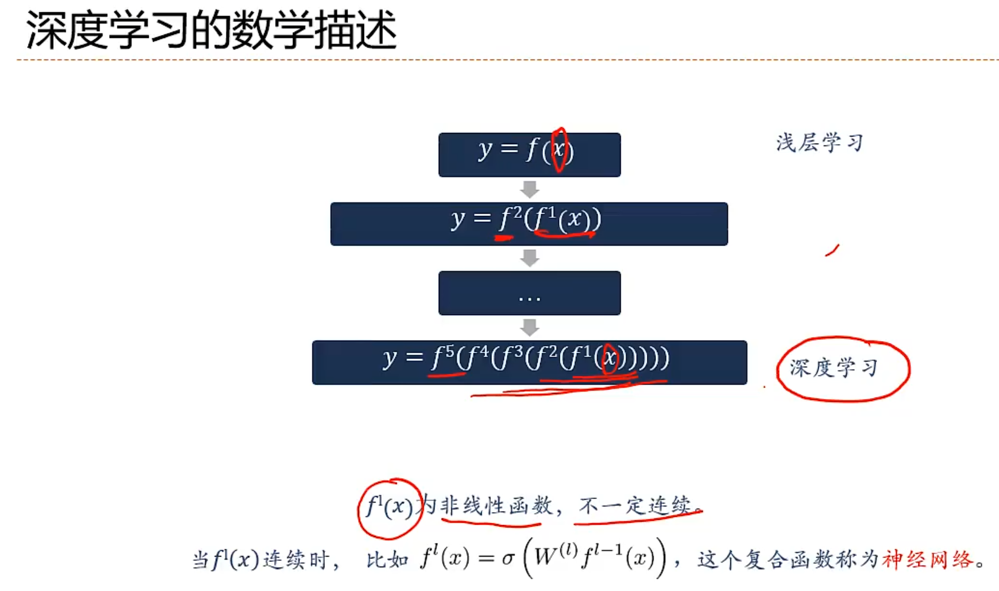

### 1. LLM（自然语言处理）, Transformer 逐层分解，8 大神经网络

- **FNN** 前馈网络
- **CNN** 卷积层网络
- GAN
- **RNN** 循环反馈网络
- ANN
- GNN
- Auto encoder
- **LSTM** Long-Short Txxx Model 长短 xxx
- Transformer
  

  
  

#### 神经网络发展史
神经网络的发展大致经过五个阶段：  
- 第一阶段：模型提出  
  在1943年描述了理想化的人工神经网络，并构建了一种基于简单逻辑运算的机制。这个神经网络模型称之为**MP模型**。  
- 阿兰·图灵在1948年的论文中描述了一种“B型图灵机”（赫布型学习）  
- 1951年，建造了第一台神经网络机，称为**SNARC**。  
- Rosenblatt【1958】最早提出可以模拟人类感知能力的神经网络模型，并称之为**感知器(Perceptron)**，并提出了一种接近于人类学习过程（迭代，试错）的学习算法。  
- 第二阶段：冰河期  
- 第三阶段：反向传播算法引起的复兴  
- 1986年，重新发明了反向传播算法。  
- 1989年，将反向传播算法引入了卷积神经网络，并在手写体识别上取得了很大的成功。  
- 第四阶段：流行度降低  
- 第五阶段：深度学习的崛起  
- 2006年，发现多层前馈神经网络可以先通过逐层预训练，再用反向传播算法进行精调的方式进行有效学习。  
   **深度神经网络在语音识别和图像分类等任务上的巨大成功。**  
- 2013年，第一个现代深度卷积网络模型-AlexNet，是深度学习技术在图像分类上取得真正突破的开端。  
- 随着大规模并行计算以及GPU设备的普及，计算机的计算能力得以大幅提高。  
  此外，可供机器学习的数据规模也越来越大。在计算能力和数据规模的支持下，计算机已经可以训练大规模的人工智能神经网络。  
  

### 2. RAG（私有知识库，给大模型参考）， Agent（19 种框架。 让大模型自主决策，并执行任务）

### 3. LangChain（构建，管理 LLM 的开发框架） / LangGraph

### 4. 预训练，微调（Fine-tuning，3 种方式）

### 5. 实战微调大模型

##### 微调： 考前复习

##### RAG： 考试带小抄

- Retrieval（检索）： from 外部数据库
- Augmentation（增强）： 检索结果一起发送给 AI
- Generation（生成）： 加强后的输入 -> 最终回答

### 微调 -> LLM/Transformer(LangChain/LangGraph) -> 微调实践 -> AI 系统工程师架构师

### 实战：1. 医疗药典，智能监控，诊标系统

### Embedding：对于上传的文件进行解析的。 为本数据 -> Embedding ->向量数据

### R 检索： Chat 模型 / Embedding 模型（文本转换，图形）

### 本地部署流程：

1.下载 Ollama，通过 Ollama 将 DeepSeek 模型下载到本地运行  
2.下载 RAGflow 源代码和 Docker，通过 Docker 来本地部署 RAGflow  
3.在 RAGflow 中构建**个人知识库**，并实现基于个人知识库的对话问答

7b（70 亿） GPU：8G
13b GPU：16G
33b GPU：32G

**语言类**（可能根本不支持视觉）：
Gemma, DeepSeek(底层也是 qwen), qwen2

**视觉类**
llava  
★minicpm-v

## 深度学习的数学描述
- y = f(x) **浅层学习**
- y = f2(f1(x))   
 ...
- y = f5(f4(f3(f2(f1(x))))) **深度学习**
  

