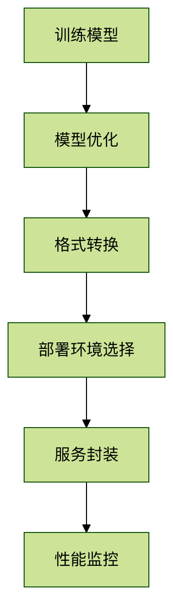

# PyTorch模型部署
模型部署是将训练好的机器学习模型投入实际应用的过程。

PyTorch提供了多种工具和方法来实现这一目标。

## 为什么需要模型部署
- **应用集成：**  将AI能力整合到Web，移动端或嵌入式系统中
- **性能优化：**  针对生产环境优化模型推理速度
- **资源管理：**  有效利用计算资源，实现高并发服务

## 部署流程概览


----------------------------------------------
# 模型准备与优化
## 模型导出格式
PyTorch主要支持以下导出格式：

|格式            |特点                                 |适用场景               |
|:---------------|:------------------------------------|:----------------------|
|TorchScript     |Pytorch原生格式，保持东动态图特性    |PyTorch生态内部使用    |
|ONNX            |开放标准，跨框架兼容                 |多框架协作环境         |
|Torch-TensorRT  |NVIDIA优化格式                       |GPU推理加速            |

## 导出为TorchScript
### 实例
```python
import torch
import torchvision

# 加载与训练模型
model = torchvision.models.resnet18( pretrained = True )
model.eval()  # 验证模式

# 示例输入
example_input = torch.rand( 1, 3, 224, 224 )

# 方法1：通过追踪(tracing)导出
traced_script = torch.jit.trace( model, example_input )
traced_script.save( "resnet18_traced.pt")

# 方法2：通过脚本（scripting）导出
scripted_model = torch.jit.script(model)
scripted_model.save( "resnet18_scripted.pt" )
```
## 注意事项
1.torch.jit.trace   更适合没有控制流的模型
2.torch.jit.script  能处理包含判断条件等复杂逻辑的模型
3.导出前务必调用model.eval()

----------------------------------
# 部署方案选择
## 本地部署方案
### LibTorch (C++ API)
```C++
// 实例

#include <torch/script.h>

int main(){
  // 加载模型
  torch::jit::script::Module module;
  module = torch::jit::load("resnet18.pt");

  //准备输入
  std::vector<torch::jit::IValue> inputs;
  inputs.push_back( torch::ones({1, 3, 224, 224}));

  // 执行推理
  auto output = module.forward(inputs).toTensor();
  std::cout << output.slice(/*dim=*/1, /*start=*/0, /*end=*/5) << '\n';
}
```

### ONNX Runtime
```python
# 实例
import onnxruntime as ort

# 创建推理会话
sess = ortx.InterfaceSession("model.onnx")

# 准备输入
input_name = sess.get_inputs()[0].name
input_data = np.random.rand(1, 3, 224, 224).astype(np.float32)

# 执行推理
outputs = sess.run(None, {input_name: input_data})

```
-----------------------------
# 云端部署方案
## TorchServe (官方服务框架)
```shell
# 安装
pip install torchserve torch-model-archiver

# 打包模型
torch-model-archiver  --model-name resnet18 \
                      --version 1.0 \
                      --serialized-file model.pth \
                      --extra-files index_to_name.json \
                      --handler image_classifier \
                      --export-path model_store

# 启动服务
torchserve --start --model-store model_store --models resnet18=resnet18.mar

```
## 使用FastAPI构建REST API
```pythone
#实例
from fastapi import FastAPI
from PIL import Image
import io
import torch

app = FastAPI()
model = torch.jit.load( "model.pt" )

@app.post("/predict")
async def predict(image: UploadFile = File(...)):
    img_data = await image.read()
    img = Image.open(io.BytesIO(img_data))

    # 预处理。。。
    with torch.nograd():
        output = model(img_tensor)
    
    return {"prediction": output.argmax().item()}

```

-------------------------------------
# 性能优化技巧
## 量化加速
```python
# 实例

# 动态量化
quantized_model = torch.quantization.quantize_dynamic(
  model,
  {torch.nn.Linear},
  dtype=torch.qint18
)

# 静态量化
model.qconfig = torch.quantization.get_default_qconfig("fbgemm")
torch.quantization.prepare(model, inplace=True)

// 校准
torch.quantization.convert(model, inplace=True)
```

## 使用Tensor加速
```python
# 实例

import torch_tensorrt

# 编译优化
trt_model = torch_tensorrt.compile(
  model,
  inputs=[torch_tensorrt.Input((1, 3, 224, 224))],
  enabled_precisions={torch.float32}  # 或 {torch.float16}
)

# 保存优化后模型
torch.jit.save( trt_model, "model_trt.pt" )
```

-----------------------------
# 常见问题解答
## Q1.不属时出现版本兼容性问题怎么办？
A: 建议使用Docker容器固定环境版本，或通过conda创建专用环境。

## Q2.如何监控部署模型的性能？
A:可以集成Prometheus等监控工具，跟踪延迟，吞吐量和资源使用情况。

## Q3.模型部署后如何实现热更新？
A:TorchServe支持模型版本管理和A/B测试，可通过API动态切换模型版本。
