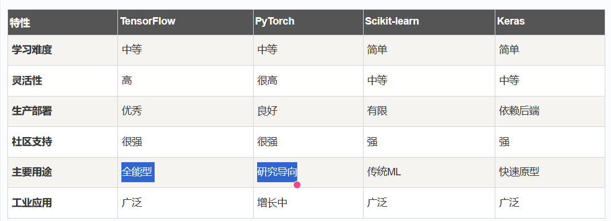

# 简介
TensorFlow是一个**数学计算的工具箱**，专门为机器学习任务而设计，让开发者能够轻松地构建从简单线性回归到复杂神经网络的各种模型。  

TensorFlow是由Google开发的开源机器学习框架，用于构建和训练各种机器学习和深度学习模型。  

TensorFlow名字来源于其核心概念： Tensor（张量）和Flow（流动），表示数据以张量的形式在计算图中流动。  

TensorFlow 官网：https://www.tensorflow.org/  
TensorFlow 学习：https://www.tensorflow.org/learn?hl=zh-cn  
TensorFlow Github：https://github.com/tensorflow  

TensorFlow是由Google Brain团队开发的开源机器学习框架，广泛应用于深度学习研究和生产环境。  
它提供了一个灵活的平台，用于构建和训练各种机器学习模型。  

# 核心概念
### 张量（Tensor）：  多维数组，是TensorFlow中的基本数据单位
### 计算图(Computational Graph):  描述数据(Tensor)流动(Flow)的有向图
### 会话(Session):  执行计算图的运行时环境  

输入数据  ->  张量  ->  计算图  ->  会话执行  ->  输出结果  

# TensorFlow的历史和发展
### 发展时间线
- 2015年11月:  TensorFlow 1.0正式开源发布
- 2019年10月:  TensorFlow 2.0发布, 引入 Eager Execution 和 Keras 集成
- 至今:  持续更新

### 关键里程碑
#### TensorFlow 1.x时代:
- 基于静态计算图
- 需要显示创建 Session
- 学习曲线较陡峭
#### TensorFlow 2.x时代:
- 默认启用 Eager Execution(即时执行)
- 深度集成 Keras 高级API
- 更加 Pythonic 和用户友好
- 简化了模型构建和训练流程

# TensorFlow的核心特点
## 1.灵活性与可扩展性
- **多平台支持**:  可在CPU,GPU,TPU上运行
- **多语言绑定:**  支持 Python, C++, Java, Go 等多种编程语言
- **跨设备部署:**  从服务器到移动设备,从云端到边缘计算

## 2.强大的生态系统
```python
TensorFlow  生态系统
  |_ TensorFlow Core      核心库
  |_ TensorFlow Lite      移动 和 嵌入式 设备
  |_ TensorFlow.js        javascript 和 网页
  |_ TensorFlow Serving   模型服务化
  |_ TensorFlow Extended  (TFX)生产级ML管道
  |_ TensorFlow Hub       预训练模型库
  |_ TensorFlowBoard      可视化工具

```

## 3.高性能计算
- **自动微分:**    自动计算梯度,简化反向传播
- **向量化运算:**  充分利用现代处理器的并行计算能力
- **分布式训练:**  支持多机多卡的大规模训练
- **图优化:**      编译时和运行时的多种优化策略 

## 4.易用性(TensorFlow 2.x)
- **Keras集成:**         提供高级,直观的API
- **Eager Execution:**   向写普通Python代码一样编写机器学习代码
- **丰富的预构件组件:**  层, 优化器, 损失函数 等开箱即可用

# TensorFlow的主要应用场景
## 1.深度学习 和 神经网络
- **图像识别:**      物体检测,人脸识别,医学影像分析
- **自然语言处理:**  机器翻译, 情感分析, 聊天机器人
- **语音处理:**      语音识别, 语音合成, 音频分类
- **推荐系统:**      个性化推荐,内容过滤

## 2.传统机器学习
- **回归分析:**  线性回归,逻辑回归
- **分类问题:**  支持向量机,决策树
- **聚类分析:** K-means, 层次聚类
- **降维技术:**  主成分分析(PCA)  

## 3.强化学习
- **游戏AI:**      AlphaGo, 游戏智能体
- **自动驾驶:**    路径规划,决策指定
- **机器人控制:**  动作控制,任务执行

## 4.科学计算
- **数值计算:**  科学模拟,数学建模
- **优化问题:**  非线性优化,约束优化
- **信号处理:**  图像处理,音频分析

# TensorFlow与其他框架的比较


# TensorFlow的优势
- **成熟的生产生态:**  从研发到部署的完整解决方案
- **谷歌支持:**        持续的资源投入和技术更新
- **大规模部署:**      经过谷歌等大公司的实战经验
- **硬件优化:**        对 TPU 等专用硬件的原生支持

# TensorFlow的使用场景
### 选择TensorFlow当你需要:
- 构建生产级机器学习系统
- 部署到多种平台(服务器,移动端,网页)
- 大规模分布式训练
- 利用谷歌生态系统
- 需要完整的 MLOps 工具链  

# 谁在使用 TensorFlow
## 知名企业
- **Google:**  搜索,广告,Gmail,Google Photos
- **Uber:**    自动驾驶,需求预测,定价算法
- **Airbnb:**  搜索排序,价格推荐,欺诈检测
- **Twitter:** 时间线排序,广告定向,内容推荐
- **Intel:**   硬件优化,边缘计算解决方案  

## 应用领域
- **医疗保健:**  医学影像分析,药物发现,疾病预测
- **金融服务:**  风险评估,算法交易,欺诈检测
- **零售电商:**  推荐系统,库存管理,价格优化
- **制造业:**    质量检测,预测维护,供应链优化
- **媒体娱乐:**  内容推荐,视频分析,音乐生成  

## 学习路径建议
- **1.第一阶段:**  掌握张量操作和基本概念
- **2.第二阶段:**  学习使用 Keras 构建简单模型
- **3.第三阶段:**  完成实际项目(图像分类,文本分析等)
- **4.第四阶段:**  深入学习高级特性和生产部署


