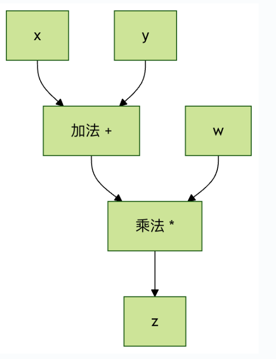
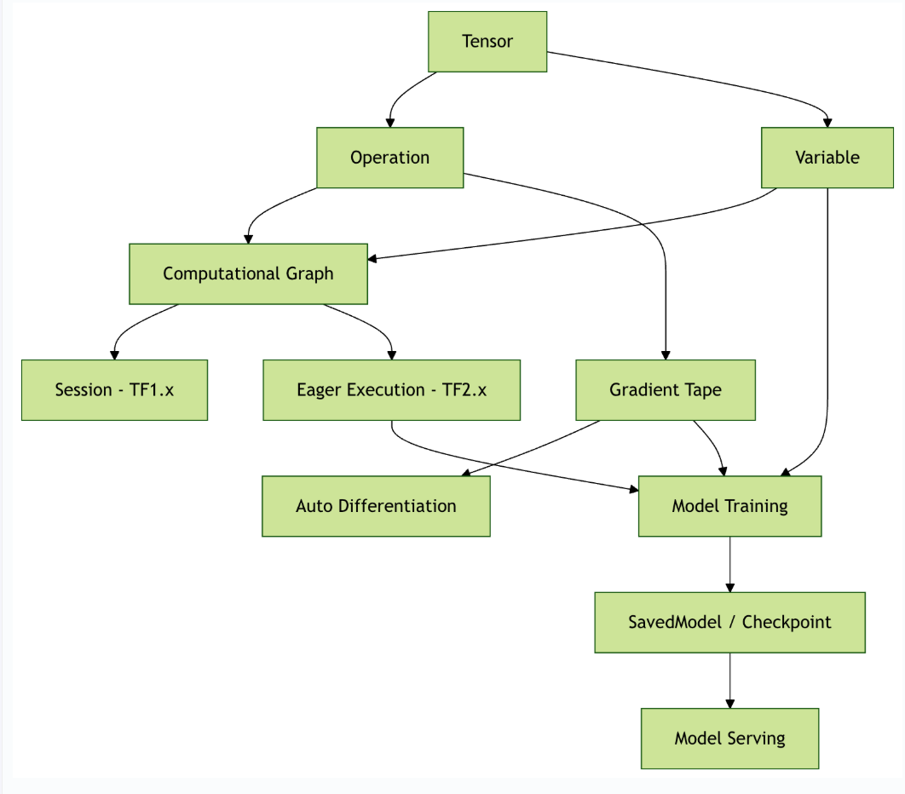

# TensorFlow核心概念
TensorFlow 的名字来源于其处理数据的核心结构 - 张量（Tensor）和计算流程（Flow）。

TensorFlow 是一个端到端的开源机器学习平台，它的核心优势在于：

- 灵活的计算图模型：支持动态图和静态图两种模式
- 跨平台部署能力：可在 CPU、GPU、TPU 和移动设备上运行
- 丰富的生态系统：包含 TensorFlow Lite（移动端）、TensorFlow.js（浏览器端）等子项目
- 生产就绪：提供从研究到生产的完整工具链  

# 核心概念解析
### 张量(Tensor)
张量是 TensorFlow中最基本的数据结构,可以理解为**多维数组**的泛化概念。  

从数学角度来说，张量是一个可以用来表示在一些矢量，标量和其他张量之间的线性关系的多线性函数。  

### 简单类比
- **标量（0维张量）：**  一个数字，如 5
- **向量（1维张量）：**  一列数字，如 [1, 2, 3, 4]
- **矩阵(2维张量):**     数字的表格, 如 [ [1, 2], [3, 4]]
- **3维张量:**           数字的立方体, 如 彩色图像(高 x 宽 x 颜色通道)
- **更高维张量:**        例如视频数据( 时间 x 高 x 宽 x 颜色通道)

### 张量的关键属性
```python
# 示例张量
import tensorflow as tf

# 创建一个 2x3 的矩阵张量
tensor = tf.constant([
  [1,2,3],
  [4,5,6]
])

print(f"\n\n形状(Shape): {tensor.shape}")  # (2, 3)
print(f"数据类型(Dtype): {tensor.dtype}")  # <dtype: 'int32'>
print(f"维度(Rand): {tf.rank(tensor)}")    # 2
print(f"设备(Device): {tensor.device}")    # /job:localhost/replica:0/task:0/device:CPU:0

```

### 关键属性解释:
##### 1.形状(Shape):  描述每个维度的大小
  1. (2, 3)表示2行3列的矩阵
  2. (224,224,3)表示 224x224像素的RGB图像

##### 2.数据类型(Dtype):  张量中数据的类型
  1. tf.float32:  32位浮点数(最常用)
  2. tf.int32:    32位整数
  3. tf.bool:     布尔值
  4. tf.string:   字符串

##### 3.维度/秩(Rank):  张量的维数
  1. 标量:  秩为0
  2. 向量:  秩为1
  3. 矩阵:  秩为2

##### 4.设备(Device):  张量存储的设备位置
  1. CPU:  /device:CPU:0
  2. GPU:  /device:GPU:0

### 张量在机器学习中的意义
##### 数据表示:
- **输入数据:**  图像,文本,音频都可以表示为张量
- **模型参数:**  权重和偏置都是张量
- **中间结果:**  计算过程中的所有数据都是张量
- **输出结果:**  预测结果,损失值等

##### 实际例子:
- **图像分类:**  输入张量形状( batch_size, height, width, channels)
- **文本处理:**  输入张量形状(batch_size, sequence_length)
- **时间序列:**  输入张量形状(batch_size, time_steps, features)

# 计算图( Computational Graph)
计算图是一种用 **节点** 和 **边** 来表示数学运算的图结构:
- **节点(Node):**  代表数学运算( 加法,乘法,激活函数等)
- **边(Edge):**    代表数据流动的路径(张量)

### 简单例子:
```python
计算 z = (x + y) * w 的计算图：

x ──┐
    ├─→ [+] ──→ [×] ──→ z
y ──┘         ├
w ────────────┘
```


### 计算图的优势
##### 1.自动微分
- 可以自动计算梯度,实现反向传播
- 不需要手动推导复杂的梯度公式

##### 2.优化机会
- 编译时优化:  合并运算,消除冗余
- 运行时优化:  内存复用,并行计算

##### 3.可视化调试
- 使用 TensorBoard 可视化模型结构
- 便于理解和调试复杂模型

##### 4.分布式计算:
- 可以将图的不同部分分配到不同设备
- 支持跨机器的分布式训练

### TensorFlow 2.x（动态图/即时执行）：
```python
#实例
import tensorflow as tf

# 直接执行运算
x = tf.constant( [ [1.0, 2.0, 3.0]])
w = tf.Variable( tf.random.normal([3, 2]))
b = tf.Variable( tf.zeros([2]) )
y = tf.matmul(x, w) + b

print("\n\ny: ", y)
# 结果
# y:  tf.Tensor([[-4.286743  -1.7172107]], shape=(1, 2), dtype=float32)

```

# 会话(Session) 与 即时执行(Eager Execution)
### TensorFlow 1.x 的会话机制
### TensorFlow 2.x 的即时执行



