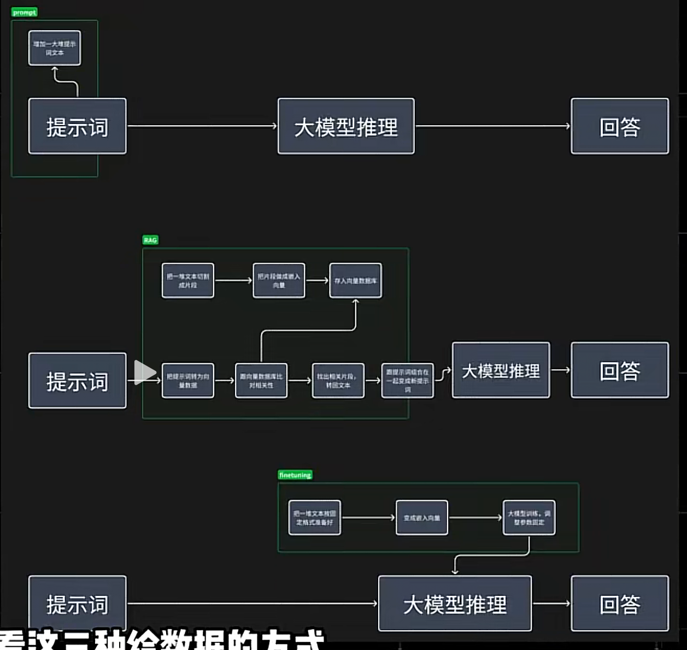
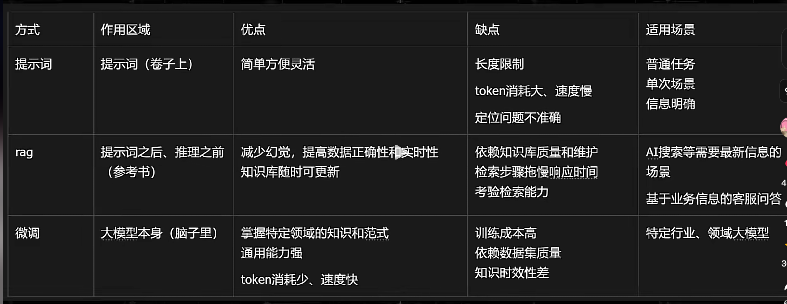

# 大模型优化的 3 种方式

- ##### 长文本
- ##### RAG
- ##### 微调

## 1.长文本提示

### 特征：只在当前对话有效，不能超出限制长度

最常用的：
拷贝文章  
 上传 PDF

发给 AI， 让它总结一下，或者修改一下，或者参考这个文章做 xxx 事情。

#### 这个就是长文本提示。

这个文章， 跟提示词拼装后发给大模型，相当于

##### 我们考试的时候，卷子上前面写了一大段文章，下面来一句，请问作者想表达什么样的思想感情？

##### 那这一整段合在一起，才是我们的考题。

不管卷子上写的文章有多长，我们其实都是临场才看到的。 卷子一收走，肯定什么也记不住。

##### 这个长文本数据也一样，它只能在你的这个对话窗口内有效，而且还不能超过它模型本身支持的上下文长度。

- 1000 万长文本； xxx 个 token。。。

### 弊端：

要给 AI 很长的长文本，AI 得临时看这么长的东西，还要快速地作答，这其实并不容易做到。
所以有的厂，很巧妙地用了另一种优化技术，来假装无损长文本， 那就是 RAG。

# 2.RAG 检索增强生成 ： 知识库

### 特征：外置独立数据库，大模型临时调用

RAG 中给到 AI 的数据，是常说的 **知识库**

知识库：  
 好比我们写论文的时候，在图书馆里有一大堆书，是学校给你准备的知识库，但是都没在你脑子里。

只有当你开始写某个主题的时候，你才会根据你的需要去把一些相关的书籍，段落都找出来，参考和引用。

这个过程你并不会把图书馆所有的书都看了，甚至你拿回来的那几本书都不一定全看了。

你是按照跟你论文的相关性，在一个大的图书馆里搜索你要用的那几本，参考参考，引用引用，再给它组织出一片论文出来。

**RAG 的知识库数据也是单独放在外面的，提什么问就去搜什么数据，** 大模型也只是拿过来给你组织组织，跟我们写论文很像。

像我们看到的各种 AI 搜索，例如， **蜜塔, perplexity，都是用的 RAG。**

## 3.微调 (fine tuning) 喂数据

其实在微调中说的数据，应该才是大家常说的“喂数据”。

**喂饭： 　　　　　　　　　　　　微调**  
咀嚼消化　　　　　　　　　　　转化为规律
固定成肥肉　　　　　　　　　　固定到参数

**其实在微调之前，真正做大模型的厂商已经做过了一步叫做**

#### 予训练，

这一步用了大量的数据，算力，让它有了

#### 基础知识，

相当于先做了一个 12 年的基础教育，

#### 微调， 就是你作为一个高中毕业的学生，

上大学，假如你选了一个医学专业，

#### 在大学里花 4 年给你微调一下子，专门针对医学这个领域，给你一大堆知识和练习，

让这个方向的知识和技能长到你的脑子里去，

#### 但是，不是死记硬背，

它是把接收到的信息，**压缩成了一种规律，把它记住的。**

那你以后看见有人发烧咳嗽，你一

#### 推测，

这个大概率就是感冒了。  
**甚至你还能沿着这个规律，去推测一些你没学过的病症。**

##### 长文本

长文本提示，是直接在提示词的部分，是**写在卷子上**。

##### RAG

提示词之后， 和推理之前，加了一步： 找资料，是**写在了参考书里**。

##### 微调

直接在大模型本身在上考场**之前就先学进了脑子里**。

# 优缺点

**长文本：**
写在卷子上， 方便灵活，成本低； 但是有长度限制，token 损耗大，速度慢，定位问题不准确。

例：  
根据这篇新闻，给我写一篇短视频的文稿

**RAG**
可以临时查资料，准确性高，而且多加几本书，它就能回答更多问题。
缺点是，还得键个图书馆，非常依赖你有哪些书，你的书是不是正经的书。  
搜的慢，也拖慢答题速度。

例：  
我把我的视频都做成知识库，大家可以去问它，本地大模型部署那个视频里说要下载什么来着？

**微调**
写进脑子里的当然适用的场景就多了，而且张口就来， 但是**学习成本也很高**，同时也取决于你上的什么学校，你学的好不好，而且**如果又有什么新知识了，你就不一定知道了**。

另外，记在脑子里的东西也不一定完全靠谱，因为即便你学好了，你上到考场也可能答错，所以这个大模型，适合的是以后准备长期干这个事儿，

例：
我把我说过的所有的话都搜集起来，微调一个学会我语气的模型，以后就让它来用我的语气写一篇文章

# 以上 3 种，并不是非此即彼的。

# 我们上了大学也得查资料，查了资料也得看卷子，这 3 种常见的提高大模型能力的方法都可以搭配来用。
