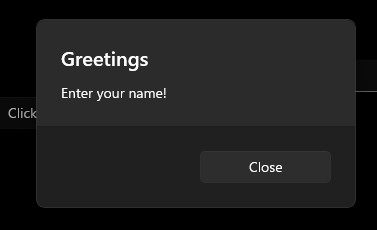

# WinUI3 / C++/winRT

# アプリ生成
## 1. xxx.vcproj
```xml
<AppxPackage>false</AppxPackage>
<WindowsPackageType>None</WindowsPackageType>
```
## 2. Tools > NuGet Package Manager > Manage NuGet Packages for solution
Updates配下のすべてを最新版に

## 3. download Windows App SDK 1.6xxx
https://learn.microsoft.com/ja-jp/windows/apps/windows-app-sdk/downloads

# Window type
runtimeclass MainWindow : Microsoft.UI.Xaml.Window

# TextBlock
```xml
<TextBlock Text="{x:Bind MyProperty}" />
```

# ボタン文言設定
```c++
myButton().Content(box_value(L"Clicked"));
```
### *remember: XAML name is "colorPanel" -> ソース上では"colorPanel()"で取得する。 

# メモリデータ　→　UI
```C++
void MainWindow::MyProperty(int32_t value)
{
    this->propertyValue = value;
    this->Bindings->Update();
}
```

# debug文言出力 / hstring型生成→伝統文字列への変換
```C++
OutputDebugString(L"Property value updated to: ");
OutputDebugString(winrt::to_hstring(propertyValue).c_str());
OutputDebugString(L"\r\n");
``` 

# ラジオボタン
# Border / RadioButton
```xml 
<!-- Epsode2 -->
<StackPanel Orientation="Vertical">
    <Border x:Name="colorPanel" Width="64" Height="64" CornerRadius="32" />
    <RadioButton x:Name="yellowButton" Content="Yellow" Checked="yellowButton_Checked" />
    <RadioButton x:Name="blueButton" Content="Blue" Checked="blueButton_Checked" />
    <RadioButton x:Name="redButton" Content="Red" Checked="redButton_Checked" />
</StackPanel>
```

# Border の色設定 SolidColorBrush / Colors
```C++ 
colorPanel().Background(Microsoft::UI::Xaml::Media::SolidColorBrush{ Microsoft::UI::Colors::Yellow() });
```
### * SolidColorBrush - winrt::Microsoft::UI::Xaml::Media::SolidColorBrush
### * Colors - winrt::Microsoft::UI::Colors

# テキストボックス　＆　ボタン
# TextBox / Button
```xml 
<StackPanel Orientation="Vertical" Margin="20,0,0,0">
    <TextBox x:Name="nameBox" Header="Enter your name" Width="200" />
    <Button x:Name="sayHiButton" Content="Say Hi!" Click="sayHiButton_Click" />
</StackPanel>
```

# コンテントダイヤログ(modal)

# dialog: Microsoft::UI::Xaml::Controls::ContentDialog

```C++
private:
    winrt::fire_and_forget showMessage(hstring message);


winrt::fire_and_forget MainWindow::showMessage(hstring message)
{
    Microsoft::UI::Xaml::Controls::ContentDialog dlg{};

    dlg.XamlRoot(this->Content().XamlRoot());  // 現在WindowのContent Root
    dlg.Title(box_value(L"Greetings"));        // box_value(): c string to IInspectable type
    dlg.Content(box_value(message));
    dlg.CloseButtonText(L"Close");

    co_await dlg.ShowAsync(); // 最後にco_awaitを付ける
}

void MainWindow::sayHiButton_Click(winrt::Windows::Foundation::IInspectable const& sender, winrt::Microsoft::UI::Xaml::RoutedEventArgs const& e)
{
    if (nameBox().Text().empty()) {
        showMessage(L"Enter your name!");
        return;
    }//endif

    showMessage(hstring{ L"Hi, " + nameBox().Text() });
}

```

# コンポボックス
```xml
<ComboBox x:Name="manualList" />
```
###### 値追加
```c++ 
int32_t manualIndex = 0;

manualIndex++;
manualList().Items().Append(box_value(hstring{ L"Item " + to_hstring(manualIndex) }));
```

### vectorでコンボボックス値管理
```xml 
<ComboBox x:Name="sourceList" Header="ItemsSource List" Width="200" />
<Button x:Name="addSourceItemBtn" Content="Add Item" Click="addSourceItemBtn_Click" />
```
```C++ 
int32_t sourceIndex = 0;
winrt::Windows::Foundation::Collections::IObservableVector<hstring> sourceArray{ winrt::single_threaded_observable_vector<hstring>() };

/// <summary>
/// constructorかLoadedイベントでvectorをコンボボックスにバインド
/// </summary>
MainWindow::MainWindow() {
    InitializeComponent();  // important!!!

    sourceList().ItemsSource(sourceArray);
}

void MainWindow::addSourceItemBtn_Click(winrt::Windows::Foundation::IInspectable const& sender, winrt::Microsoft::UI::Xaml::RoutedEventArgs const& e)
{
    sourceIndex++;

    sourceArray.Append(hstring{ L"Item " + to_hstring(sourceIndex) });
    if (sourceList().SelectedItem() == nullptr)
        sourceList().SelectedIndex(0);
}

### bindでコンボボックスに値追加

```xml 
<ComboBox x:Name="boundList" Header="Bound List" Width="200" ItemsSource="{x:Bind collection}"/>
<Button x:Name="addBoundItemBtn" Content="Add Item" Click="addBoundItemBtn_Click" />
```


```C++
private: 
    int32_t boundIndex = 0;
    winrt::Windows::Foundation::Collections::IObservableVector<hstring> boundArray{ winrt::single_threaded_observable_vector<hstring>() };

public:
    winrt::Windows::Foundation::Collections::IObservableVector<hstring> collection();

// ------------------- cpp
void MainWindow::addBoundItemBtn_Click(winrt::Windows::Foundation::IInspectable const& sender, winrt::Microsoft::UI::Xaml::RoutedEventArgs const& e)
{
    boundIndex++;
    boundArray.Append(hstring{ L"Item " + to_hstring(boundIndex) });

    if (boundList().SelectedItem() == nullptr)
        boundList().SelectedIndex(0);
}

///
/// collection()でboundArrayを返す
///
winrt::Windows::Foundation::Collections::IObservableVector<hstring> MainWindow::collection() {
    return boundArray;
}

```
### MainWindow.idl
```C++ 
namespace Epsode1
{
    [default_interface]
    runtimeclass MainWindow : Microsoft.UI.Xaml.Window
    {
        MainWindow();
        Int32 MyProperty;

        // XAMLのx:Bindで指定するgetter関数（public)
        Windows.Foundation.Collections.IObservableVector<String> collection{ get; };
    }
}
```


.end.
