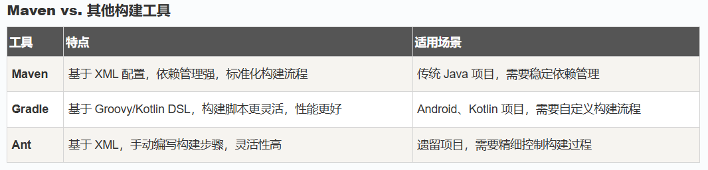
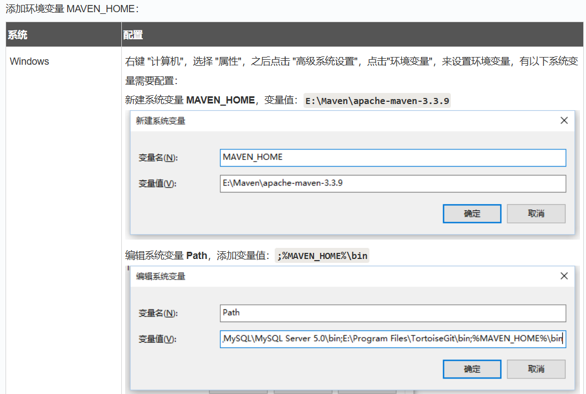

# Maven 配置文件 POM - Project Object Model
Maven 翻译为"专家"、"内行"，是 Apache 下的一个纯 Java 开发的开源项目。基于项目对象模型（缩写：POM）概念，Maven利用一个中央信息片断能管理一个项目的构建、报告和文档等步骤。

Maven 是一个项目管理工具，可以对 Java 项目进行构建、依赖管理。

Maven 也可被用于构建和管理各种项目，例如 C#，Ruby，Scala 和其他语言编写的项目。Maven 曾是 Jakarta 项目的子项目，现为由 Apache 软件基金会主持的独立 Apache 项目。

# Mave功能
 - 构建
 - 文档生成
 - 报告
 - 依赖
 - SCMs
 - 发布
 - 分发
 - 邮件列表

# Maven特点
 1. **约定由于配置：** 提供标准化的项目结构和构建生命周期
 2. **依赖管理：** 自动处理项目依赖关系
 3. **插件体系：** 丰富的插件支持各种构建任务
 4. **多模块支持：** 简化大型项目的管理
 5. **中央仓库：** 访问全球共享的库资源

# 约定配置
Maven 提倡使用一个共同的标准目录结构，Maven 使用约定优于配置的原则，大家尽可能的遵守这样的目录结构。如下所示：

| 目录                                | 目的
|--                                   |--
|${basedir}                           | 存放pom.xml和所有的子目录
|${basedir}/src/main/java             | 项目的java源代码
|${basedir}/src/main/resources        | 项目的资源，比如说property文件，springmvc.xml
|${basedir}/src/test/java             | 项目的测试类，比如说Junit代码
|${basedir}/src/test/resources        | 测试用的资源
|${basedir}/src/main/webapp/WEB-INF   | web应用文件目录，web项目的信息，比如存放web.xml、本地图片、jsp视图页面
|${basedir}/target                    | 打包输出目录
|${basedir}/target/classes            | 编译输出目录
|${basedir}/target/test-classes       | 测试编译输出目录
|Test.java                            | Maven只会自动运行符合该命名规则的测试类
|~/.m2/repository                     | Maven默认的本地仓库目录位置

# Maven简介
Maven 是一个 项目管理与构建自动化工具，主要用于 Java 项目，但也可用于其他语言（如 Kotlin、Scala）。

Maven 解决了软件构建的两方面问题：
 - 一是软件是如何构建的
 - 二是软件的依赖关系

Maven 的核心功能包括：
 - **项目构建** （编译，测试，打包，部署）
 - **依赖管理** （自动下载和管理第三方库） 自动下载和管理 .jar文件，避免手动管理依赖
 - **标准化项目结构** （约定由于配置） 提供clean, compile, test, package等标准生命周期
 - **项目模板(Archetype)** 快速生成项目结构（e.g.: maven-archetype-quickstart）
 - **多模块支持** 适用于大型项目，可以拆分多个子模块
 - **插件扩展** （支持自定义构建流程） 自定义构建任务（e.g.: maven-compiler-plugin指定java版本）

优势：
 - **减少配置：** 约定优于配置，减少 build.xml（Ant）这样的手动配置。
 - **依赖自动管理：** 只需声明依赖，Maven 自动下载并处理冲突。
 - **跨平台：** 基于 Java，可在 Windows、Linux、macOS 上运行。
 - **与 IDE 集成：** Eclipse、IntelliJ IDEA、VS Code 都支持 Maven。



# Maven 安装


# 验证安装
```bash
mvn -v 
```


