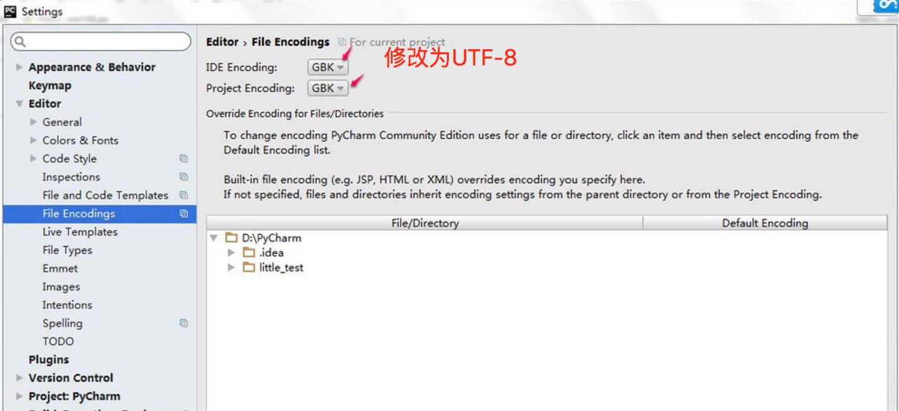

# Python基础教程
Python是一种解释型，面向对象，动态数据类型的高级程序设计语言。  

**官方宣布，2020年1月1日，停止Python2的更新。Python2.7被确定为最后一个Python2.x版本。**

# 执行Python程序
实例
```python
#!/usr/bin/python
print("Hello, World!")
```

Python3.0+版本已经把print作为一个内置函数，输出“Hello World！”代码如下：  
实例（Python 3.0
```python
#!/usr/bin/python3

print("Hello, World!")
```
# Python特点
 -**1. 易于学习；** Python有相对较少的关键字，结构简单，和一个明确定义的语法，学习起来更加简单  
 -**2. 易于阅读：** Python代码定义的更清晰  
 -**3. 易于维护：** Python的成功在于它的源代码是相当容易维护的  
 -**4. 一个广泛的标准库：** Python的最大的优势之一是丰富的库，跨平台的，再UNIX，Windows和Mac兼容很好。  
 -**5. 互动模式：** 互动模式的支持，可以从终端输入执行代码并获得结果的语言，互动的测试和调用调试代码片段。  
 -**6. 可移植：** 给予其开放源代码的特性，Python已经被移植（也就是使其工作）到许多平台。  
 -**7. 可扩展：** 如果需要一段运行很快的关键代码，或者是想要编写一些不愿开放的算法，你可以使用 C 或 C++ 完成那部分程序，然后从Python程序中调用。  
 -**8. 数据库：** Python提供所有主要的商业数据库的接口。  
 -**9. GUI编程：** Python支持GUI，可以创建和移植到许多系统调用。  
 -**10.可嵌入：** 你可以将Python嵌入到 C/C++ 程序，让你的程序的用户获得“脚本化“的能力。  

# Python环境变量
|变量名               |描述
|--                   |--
|**PYTHONHOME**       |另一种模块搜索路径。它通常内嵌于的PYTHONSTARTUP或PYTHONPATH目录中，使得两个模块库更容易切换。
|**PYTHONPATH**       |PYTHONPATH是Python搜索路径，默认我们import的模块都会从PYTHONPATH里面寻找
|**PYTHONSTARTUP**    |Python启动后，先寻找PYTHONSTARTUP环境变量，然后执行此变量指定的文件中的代码。
|**PYTHONCASEOK**     |加入PYTHONCASEOK的环境变量, 就会使python导入模块的时候不区分大小写.

# 运行Python
有三种方式可以运行Python：  
## 1.交互式解释器
可以通过命令行窗口进入 Python，并在交互式解释器中开始编写 Python代码。  
可以在 Unix，DOS或任何其他提供了命令行或者 shell 的系统进行 Python编码工作。
```shell
$ python   # Unix/Linux
or
c:>python  # Windows/DOS
```
以下为Python命令行参数：
|选项      |描述
|--        |--
|-d        |在解析时显示调试信息
|-O        |生成优化代码 ( .pyo 文件 )
|-S        |启动时不引入查找Python路径的位置
|-V        |输出Python版本号
|-X        |从 1.6版本之后基于内建的异常（仅仅用于字符串）已过时。
|-c cmd    |执行 Python 脚本，并将运行结果作为 cmd 字符串。
|file      |在给定的python文件执行python脚本。

## 2.命令行脚本
在你的应用程序中通过引入解释器可以在命令行中执行Python脚本，如下所示：
```shell
$ python script.py  # Unix/Linux

或者

C:>python script.py # Windows/DOS
```

注意：在执行脚本时，请检查脚本是否有可执行权限。

## 3.继承开发环境 IDE： PyCharm
PyCharm 是由 JetBrains 打造的一款 Python IDE，支持 macOS、 Windows、 Linux 系统。

PyCharm 功能 : 调试、语法高亮、Project管理、代码跳转、智能提示、自动完成、单元测试、版本控制……

PyCharm 下载地址 : https://www.jetbrains.com/pycharm/download/

PyCharm 安装地址：https://www.runoob.com/pycharm/pycharm-install.html

# Python中文编码
前面章节中我们已经学会了如何用 Python 输出 "Hello, World!"，英文没有问题，但是如果你输出中文字符 "你好，世界" 就有可能会碰到中文编码问题。

Python 文件中如果未指定编码，在执行过程会出现报错：

#!/usr/bin/python

print ("你好，世界")
以上程序执行输出结果为：

  File "test.py", line 2
SyntaxError: Non-ASCII character '\xe4' in file test.py on line 2, but no encoding declared; see http://www.python.org/peps/pep-0263.html for details
Python中默认的编码格式是 ASCII 格式，在没修改编码格式时无法正确打印汉字，所以在读取中文时会报错。

解决方法为只要在文件开头加入 # -*- coding: UTF-8 -*- 或者 # coding=utf-8 就行了

注意：# coding=utf-8 的 = 号两边不要空格。

实例(Python 2.0+)
```shell
#!/usr/bin/python
# -*- coding: UTF-8 -*-
 
print( "你好，世界" )
```

运行实例 »
输出结果为：

你好，世界
所以如果大家在学习过程中，代码中包含中文，就需要在头部指定编码。

注意：**Python3.X 源码文件默认使用utf-8编码，所以可以正常解析中文，无需指定 UTF-8 编码**。

注意：如果你使用编辑器，同时需要设置 py 文件存储的格式为 UTF-8，否则会出现类似以下错误信息：

SyntaxError: (unicode error) ‘utf-8’ codec can’t decode byte 0xc4 in position 0:
invalid continuation byte
Pycharm 设置步骤：

进入 file > Settings，在输入框搜索 encoding。
找到 Editor > File encodings，将 IDE Encoding 和 Project Encoding 设置为utf-8。



